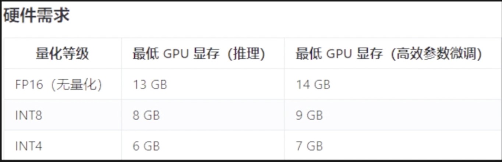

# Ubuntu桌面上玩耍AI大模型

最低配置要求：



将默认目录名称配置成英文：
```
export LANG=en_US  # 设置当前会话的语言环境变量为英文
xdg-user-dirs-gtk-update  # xdg-user-dirs 是一个管理用户日录（如”文档”、“音乐”、“图片”等）的工具，用于更新用户目录的 GTK+ 版本
```
如果执行完上述命令，没有弹出目录更改的提示框，需要重新生成user-dirs.locale文件

user-dirs.Locale 主要作用是存储关于用户目录（如“文档”、“下载”、"音乐"、“图片“等）的本地化（语言和地区）设置，如果这个文件中的语言设置为英语，那么用户目录将使用英文名称（如 Documents, Downloads），如果设置为中文，则这些目录可能会显示为中文名称（如文档，下载）。依次输入如下命令：
```
# 先生成user-dirs. locale文件
echo
'en_US'
> ~/.config/user-dirs.locale
# 再重新设置语言
export LANG=en_US
xdg-user-dirs-gtk-update
```


加速器：https://www.pigcha.com.hk/
官方永久地址： https://pigpigchacha.github.io/officialsite

加速工具：
https://github.com/gao497290234/clash-for-linux