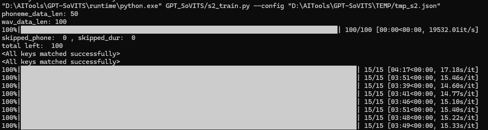
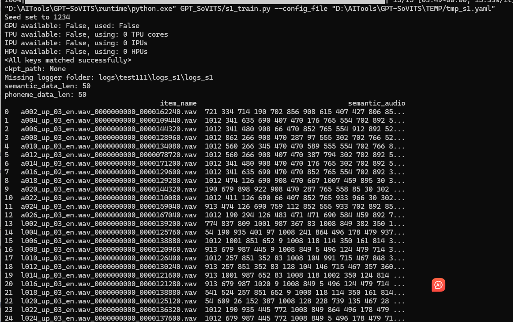
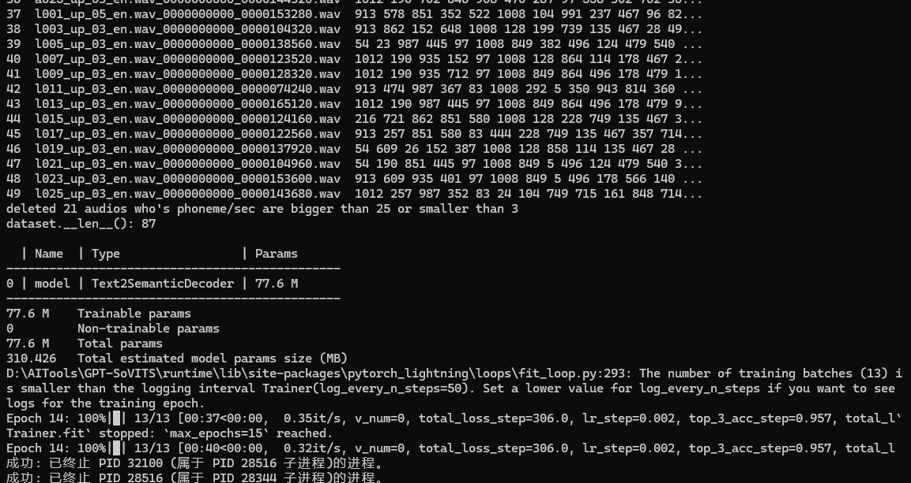
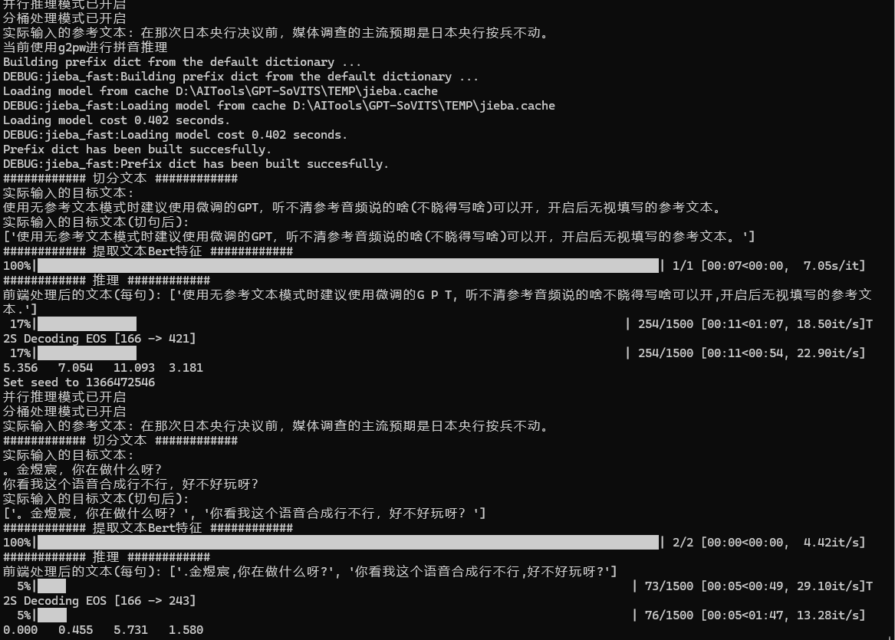

# 炼丹


国内产业链窗口：https://www.liblib.art/ 、 https://tusiart.com/ 

国外产业链窗口：https://civitai.com/

sd炼丹鼻祖脚本：https://github.com/kohya-ss/sd-scripts

sd炼丹鼻祖UI：https://github.com/bmaltais/kohya_ss

@秋葉aaaki 的SD-Trainer

@朱尼酱 的赛博丹炉


| 平台 | 炼丹炉 | 效果描述 |
| --- | --- | --- |
| Ultra5 125H 32G | Kohya_ss | Lora训练不成功，报错提示：ValueError: torch.cuda.is_available() should be True but is False. xformers' memory efficient attention is only available for GPU |
| Ultra5 125H 32G | SD-Trainer |  |
| Ultra5 125H 32G | 赛博丹炉 |  |
| Ultra5 125H 32G | GPT-SoVITS | 能炼丹，体感速度比笔记本上14900+4090慢一倍以上 |


### GPT-SoVITS at [Ultra5 125H 32G]










https://github.com/s0md3v/sd-webui-roop


```
[ipex_enhance] Applied IPEX optimize.
Model loaded in 26.2s (load weights from disk: 0.2s, create model: 0.9s, apply weights to model: 10.8s, apply half(): 0.4s, move model to device: 0.2s, load textual inversion embeddings: 0.8s, scripts callbacks: 10.1s, calculate empty prompt: 2.7s).
download_path: C:\Users\ascod/.insightface\models\buffalo_l
Downloading C:\Users\ascod/.insightface\models\buffalo_l.zip from https://github.com/deepinsight/insightface/releases/download/v0.7/buffalo_l.zip...
Applied providers: ['CPUExecutionProvider'], with options: {'CPUExecutionProvider': {}}
find model: C:\Users\ascod/.insightface\models\buffalo_l\1k3d68.onnx landmark_3d_68 ['None', 3, 192, 192] 0.0 1.0
Applied providers: ['CPUExecutionProvider'], with options: {'CPUExecutionProvider': {}}
find model: C:\Users\ascod/.insightface\models\buffalo_l\2d106det.onnx landmark_2d_106 ['None', 3, 192, 192] 0.0 1.0
Applied providers: ['CPUExecutionProvider'], with options: {'CPUExecutionProvider': {}}
find model: C:\Users\ascod/.insightface\models\buffalo_l\det_10g.onnx detection [1, 3, '?', '?'] 127.5 128.0
Applied providers: ['CPUExecutionProvider'], with options: {'CPUExecutionProvider': {}}
find model: C:\Users\ascod/.insightface\models\buffalo_l\genderage.onnx genderage ['None', 3, 96, 96] 0.0 1.0
Applied providers: ['CPUExecutionProvider'], with options: {'CPUExecutionProvider': {}}
find model: C:\Users\ascod/.insightface\models\buffalo_l\w600k_r50.onnx recognition ['None', 3, 112, 112] 127.5 127.5
set det-size: (640, 640)
Applied providers: ['CPUExecutionProvider'], with options: {'CPUExecutionProvider': {}}
inswapper-shape: [1, 3, 128, 128]
Applied providers: ['CPUExecutionProvider'], with options: {'CPUExecutionProvider': {}}
find model: C:\Users\ascod/.insightface\models\buffalo_l\1k3d68.onnx landmark_3d_68 ['None', 3, 192, 192] 0.0 1.0
Applied providers: ['CPUExecutionProvider'], with options: {'CPUExecutionProvider': {}}
find model: C:\Users\ascod/.insightface\models\buffalo_l\2d106det.onnx landmark_2d_106 ['None', 3, 192, 192] 0.0 1.0
Applied providers: ['CPUExecutionProvider'], with options: {'CPUExecutionProvider': {}}
find model: C:\Users\ascod/.insightface\models\buffalo_l\det_10g.onnx detection [1, 3, '?', '?'] 127.5 128.0
Applied providers: ['CPUExecutionProvider'], with options: {'CPUExecutionProvider': {}}
find model: C:\Users\ascod/.insightface\models\buffalo_l\genderage.onnx genderage ['None', 3, 96, 96] 0.0 1.0
Applied providers: ['CPUExecutionProvider'], with options: {'CPUExecutionProvider': {}}
find model: C:\Users\ascod/.insightface\models\buffalo_l\w600k_r50.onnx recognition ['None', 3, 112, 112] 127.5 127.5
set det-size: (640, 640)

```