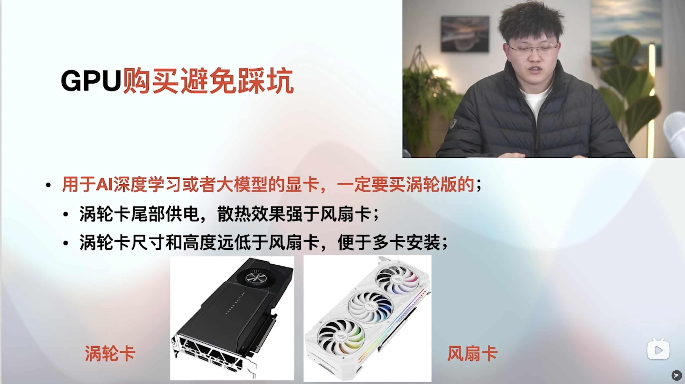
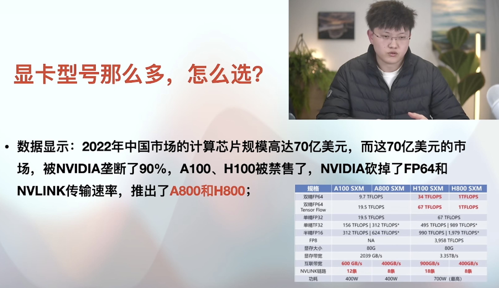

# 人工智能软硬件准备

### 软件需求：
1. Ubuntu由于Windows
2. 安装Ubuntu或者Ubuntu和windows双系统
3. 编程语言建议Python为主
4. 使用DeepSpeed等优化工具提升大模型的运行效率

### 硬件需求：
预训练：

算力最密集，消耗的算力通常是推理过程的至少三个数量级以上；
Gpt3.5，据相关人士统计，我们可以按照175B参数规模计算，训练它需要1千块80G的A100训练一个月时间
据某机构的报告，Gpt3的单次训练成本约140万美元，由此，根据模型的参数量级不同，基本上一次模型全新训练要花费200到1200万美元之间。最重要的是你一次训练并不能保证你得到的模型是效果好的，可能涉及到多次训练，这样的成本不是一般个人和企业能够承担的。所以我们普通人，普通企业更应该关注在推理和微调上面。

微调：

算力需求低于训练，但高于推理；
ChatGLM3-6B这种模型，如果做全量微调，至少需要4张80G的A100

推理：

算力消耗最低
Gpt3.5只需要9块80G的A100

ChatGLM-6B为例：

| 量化等级 | 最低 GPU 显存（推理） | 最低 GPU 显存（高效参数微调） |
| --- | --- | --- |
| 单精度 |  20G | 22G |
| 半精度 | 13G | 14G |
| INT8 | 8G | 9G |
| INT4 | 6G | 7G |

主流的显卡显存容量：超算级别显卡A100、H100、A800、H800为80G显
存；其中A100也有40G显存；消费级显卡4090和3090显存为24GB

3090支持nvlink，可以多卡训练
4090不支持nvlink，所以多卡训练返回效率变低

