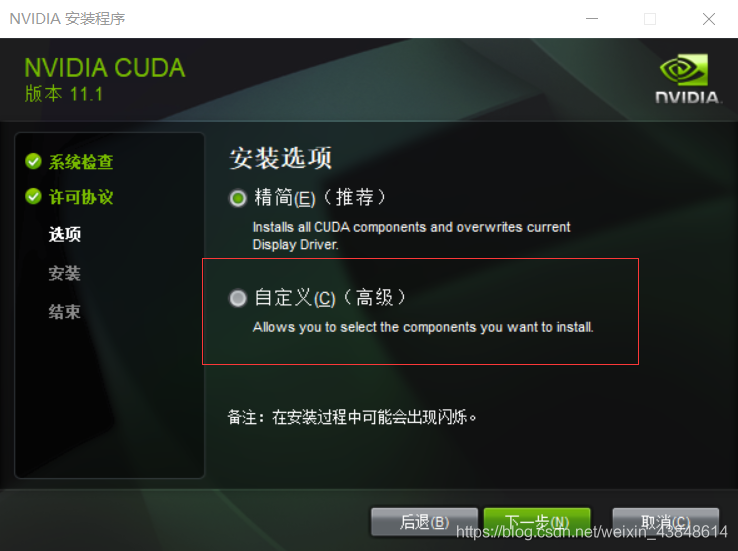
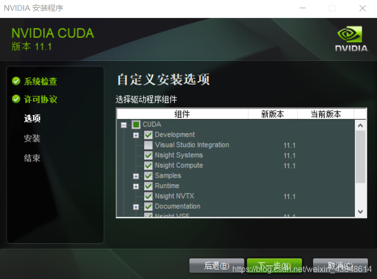
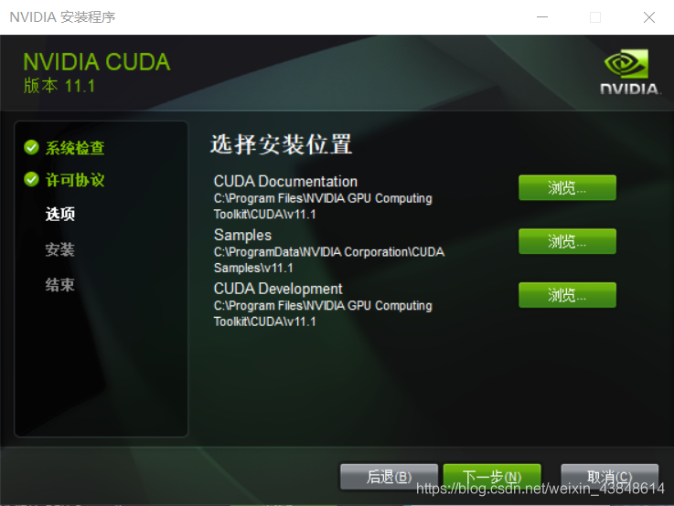
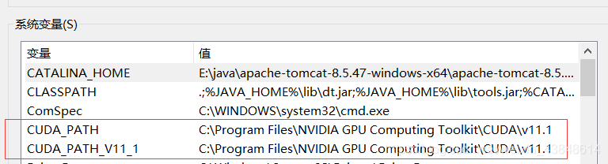
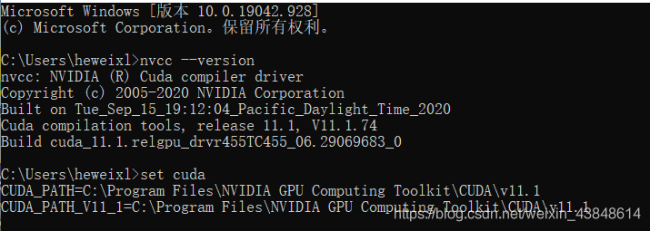
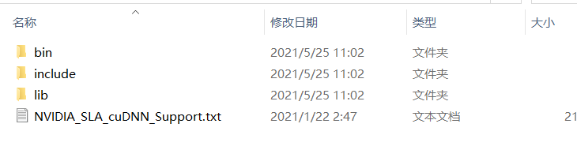
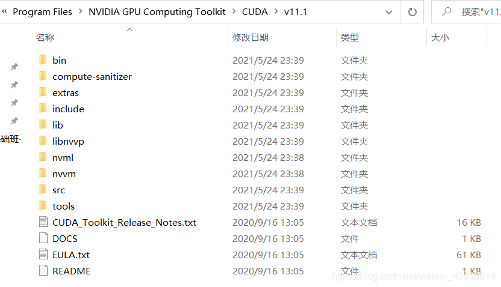
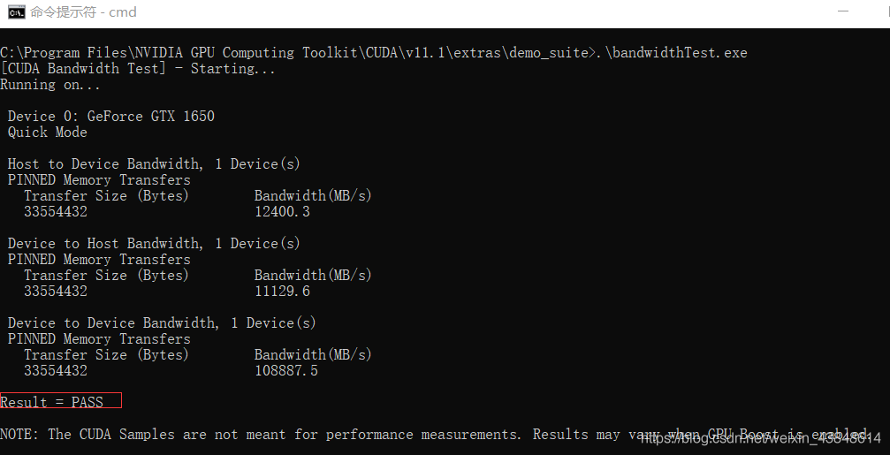
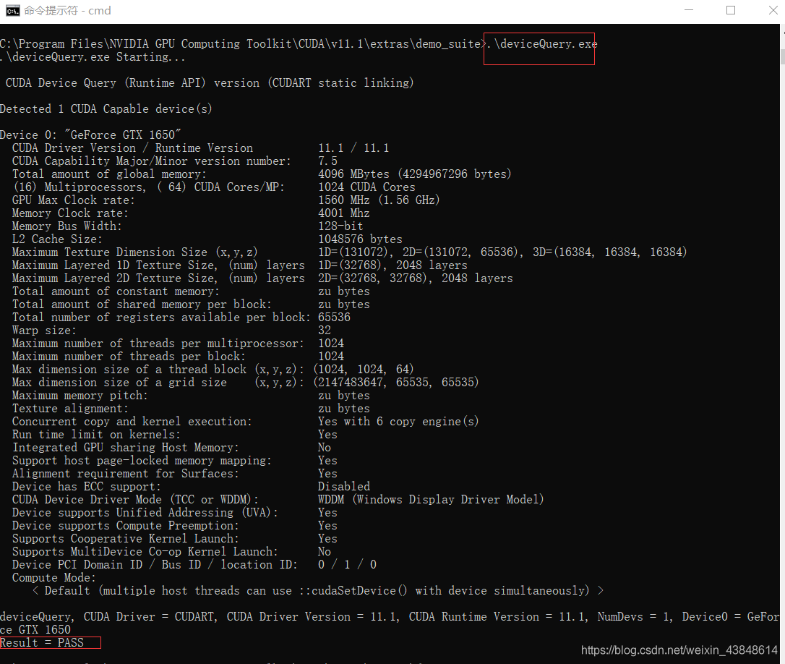

# CUDA安装 （windows版）

## 一、前言

windows10 版本安装 CUDA ，首先需要下载两个安装包

* CUDA toolkit（toolkit就是指工具包）
* cuDNN

注：[cuDNN](https://so.csdn.net/so/search?q=cuDNN&spm=1001.2101.3001.7020) 是用于配置深度学习使用

官方教程：

CUDA [https://docs.nvidia.com/cuda/cuda-installation-guide-microsoft-windows/index.html](https://docs.nvidia.com/cuda/cuda-installation-guide-microsoft-windows/index.html)

cuDNN [https://docs.nvidia.com/deeplearning/sdk/cudnn-install/index.html#installwindows](https://docs.nvidia.com/deeplearning/sdk/cudnn-install/index.html#installwindows)

## 二、安装工具的准备

安装工具的准备:

1. CUDA toolkit Download

<https://developer.nvidia.com/cuda-toolkit-archive>

官网安装：

<https://developer.nvidia.com/cuda-downloads?target_os=Windows&target_arch=x86_64>

选择版本：

GA = General Availability,通用版本,指软件的通用版本。  
RC=Release Candidate,含义 是"发布候选版",它不是最终的版本,而是最终版(RTM=Release To Manufacture)之前的最后一个版本  

官网说明文档，
<https://docs.nvidia.com/cuda/cuda-toolkit-release-notes/index.html>

CUDA的版本是跟显卡型号有关还是驱动有关？

一般是驱动版本决定了能用的CUDA版本的上限，比如新版的显卡驱动可以支持老的CUDA runtime。但是老的显卡可能无法更新到最新的显卡驱动，比如Fermi显卡只能装到391驱动，因此只能用到CUDA9.1。除此之外，显卡硬件与CUDA compute capability相关，当然编译时也可以指定streaming multiprocessor。新的架构支持更多特性就是了。

2. cuDNN Download

cuDNN地址如下，不过要注意的是，我们需要注册一个账号，才可以进入到下载界面。大家可以放心注册的。

<https://developer.nvidia.com/rdp/cudnn-download>

可以使用下面网址，查看适配的 cuDNN

<https://developer.nvidia.com/rdp/cudnn-archive>

## 三、 CUDA 安装与配置过程

1. 双击“exe文件”，选择下载路径（推荐默认路径）

2. 安装选项

如果你是第一次安装，尽量全选  
如果你是第n次安装，尽量只选择第一个，不然会出现错误  



不要选Visual Studio Integration，即使选了也不能成功安装



如果本机的驱动版本(当前版本)小于cuda对应的版本（新版本），则选择，否则不选。如果当前版本小于新版本，并且不覆盖安装，之后电脑会频繁蓝屏或死机

3. 记住安装位置，tensorflow要求配置环境



```
重点提醒：一定要记住这个路径，把这个路径保留下来，后面我们还会用到！！！
```

4. 安装进行

5. 安装完成

查看系统变量中是否添加了路径，如果没有需要自己添加



测试环境是否安装成功

运行cmd，输入nvcc --version 即可查看版本号；  
set cuda，可以查看 CUDA 设置的环境变量。  



## 四、cuDNN配置

1. 解压

cuDNN叫配置更为准确，我们先把下载的 cuDNN 解压缩，会得到下面的文件：

cuDNN 解压缩后的文件



下载后发现其实cudnn不是一个exe文件，而是一个压缩包，解压后，有三个文件夹，把三个文件夹拷贝到cuda的安装目录下。

CUDA 的安装路径在前面截图中有，或者打开电脑的环境变量查看，默认的安装路径如下：

```
C:\Program Files\NVIDIA GPU Computing Toolkit\CUDA\v11.1
```

后面那个v11.1是你自己的版本号

CUDA 安装目录文件：



拷贝时看到，CUDA 的安装目录中，有和 cuDNN 解压缩后的同名文件夹，这里注意，不需要担心，直接复制即可。cuDNN 解压缩后的同名文件夹中的配置文件会添加到 CUDA安装目录中的同名文件夹中。

现在大家应该可以理解，cuDNN 其实就是 CUDA 的一个补丁而已，专为深度学习运算进行优化的。然后再参加环境变量

2. 添加至系统变量

往系统环境变量中的 path 添加如下路径（根据自己的路径进行修改）

```
C:\Program Files\NVIDIA GPU Computing Toolkit\CUDA\v11.1\bin

C:\Program Files\NVIDIA GPU Computing Toolkit\CUDA\v11.1\include

C:\Program Files\NVIDIA GPU Computing Toolkit\CUDA\v11.1\lib

C:\Program Files\NVIDIA GPU Computing Toolkit\CUDA\v11.1\libnvvp
```

验证安装是否成功

配置完成后，我们可以验证是否配置成功，主要使用CUDA内置的deviceQuery.exe 和 bandwidthTest.exe：
首先win+R启动cmd，cd到安装目录下的 …\extras\demo_suite,然后分别执行bandwidthTest.exe和deviceQuery.exe,应该得到下图:





## 五、CUDA纯净卸载（Ubuntu）

1. 方法一：

cd到安装目录的bin文件夹

```
cd /usr/local/cuda-11.6/bin
```

然后执行cuda自带卸载程序

```
sudo ./cuda-uninstaller
```

不一定管用，如果出现找不到：cuda-uninstaller的话，使用方法二（有的人能找到，我的也找不到）

2. 方法二：

执行Ubuntu的卸载删除程序3步：

```
sudo apt-get remove cuda
sudo apt autoremove 
sudo apt-get remove cuda*
```

 程序卸载后会剩余安装包，所以cd到安装目录下：

 ```
  cd /usr/local/
 ```

 删除原有的cuda文件夹

```
sudo rm -r cuda-11.6
```

这样的话可能会有残留文件，通过以下命令查找和删除残留：

查看剩余残留：

```
sudo dpkg -l |grep cuda
```

卸载对应的残留 ：

```
sudo dpkg -P cuda-visual-tools-11-6
```

所有的查询到的残留都要删除~~

```
sudo dpkg -P 残留文件全称
```

这样就纯净卸载就都卸载干净了，可以安装需要的其他版本了。

有时候也会用到如下方法：

```
sudo rm -rf /usr/local/cuda*
```

这个方法比较暴力，直接删除cuda相关的目录，包括安装目录，驱动，cuda缓存等等。

## 六、CUDA纯净卸载（Windows）

方法：

1. 打开注册表，定位到：

```
HKEY_LOCAL_MACHINE\SOFTWARE\NVIDIA Corporation\GPU Computing Toolkit\CUDA
```

2. 删除所有子项和值

3. 删除安装目录：

```
C:\Program Files\NVIDIA GPU Computing Toolkit\CUDA
```

参考博客：

<https://blog.csdn.net/mao_hui_fei/article/details/104246466>

<https://www.pianshen.com/article/8647746165/>

<https://blog.csdn.net/weixin_45494025/article/details/100746025>

<https://blog.csdn.net/u011473714/article/details/95042856>
