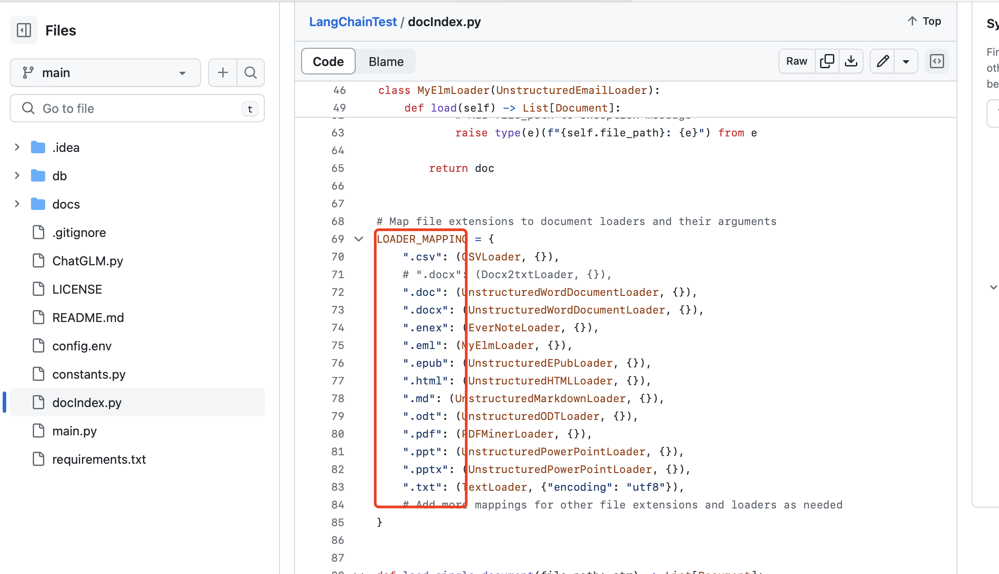

# 人工智能自研以及用于项目的可行性研究

核心问题：
1. 在行业专业领域，我们有的知识，来源于多年积攒的业内pdf文档和ppt文档，这些都能喂给大模型吗？
2. 我们将专业领域知识喂给大模型之后，是否大模型就能解答各种专业领域的问题？
3. 我们希望我提个问，大模型就能结合业务系统里面的数据给我一个答案，这个能做到吗？
4. 跟大模型对话用中文好用不？

## 结论1: 我们过去的文件都可以喂给大模型

看看这个测试项目：https://github.com/zhaoqingpu/LangChainTest

其中将本地数据导入大模型的一段代码，几乎覆盖了普通人所有的文本来源和存储格式，很显然，这是通过程序读取文件中的文本，也就是说理论上，任何存储形式的文字都是可以喂给大模型：

