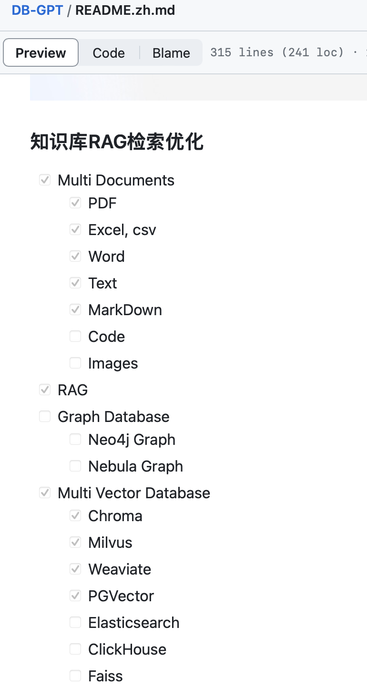
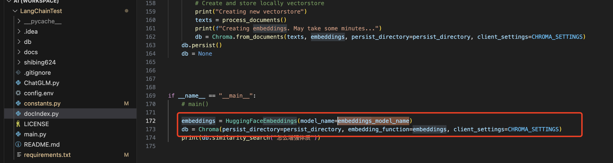
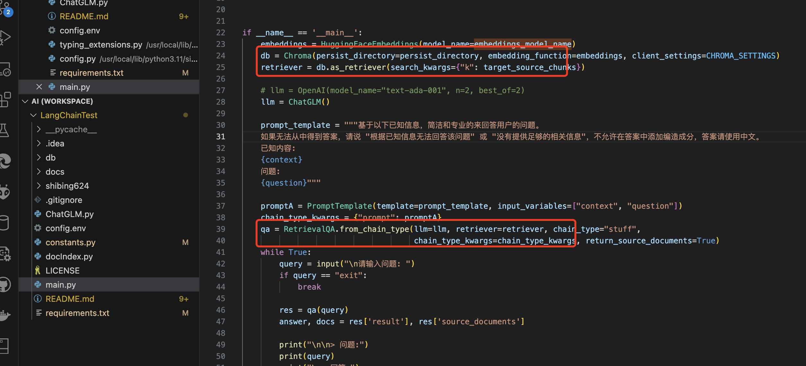
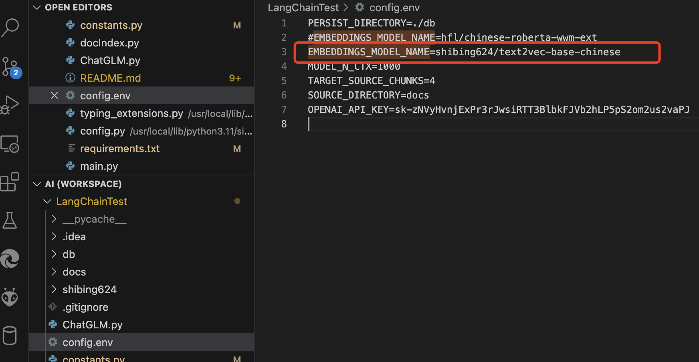
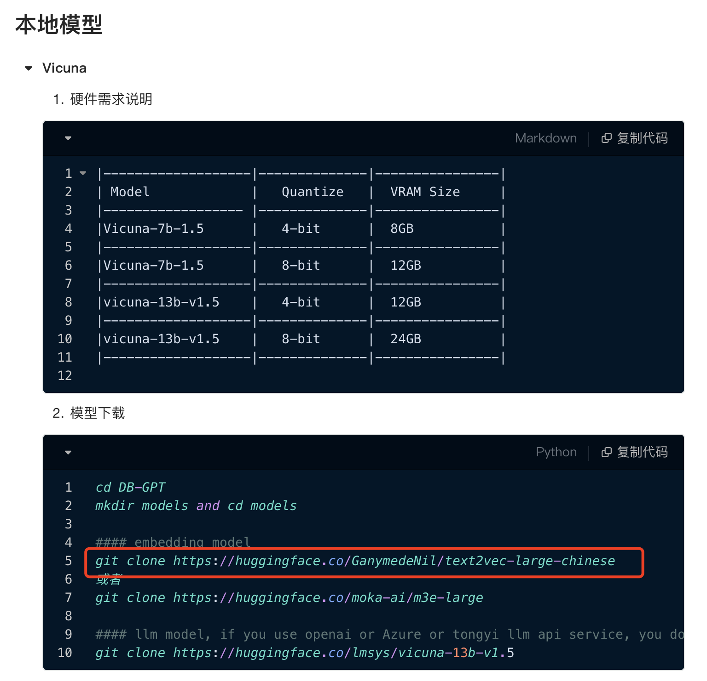
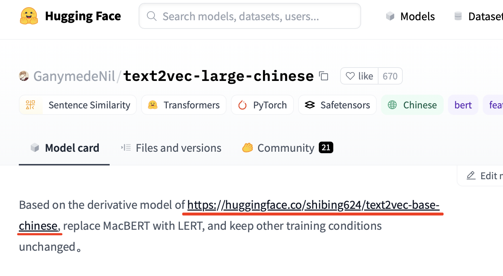
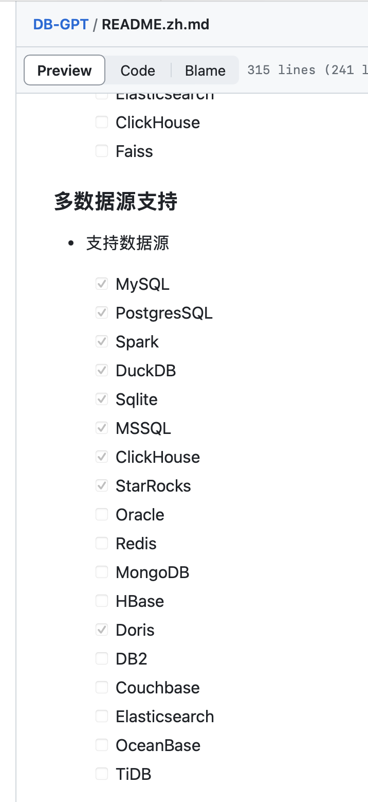
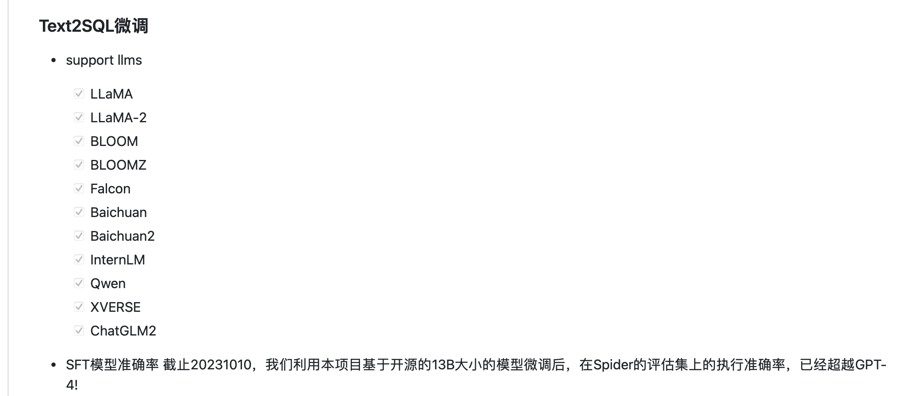
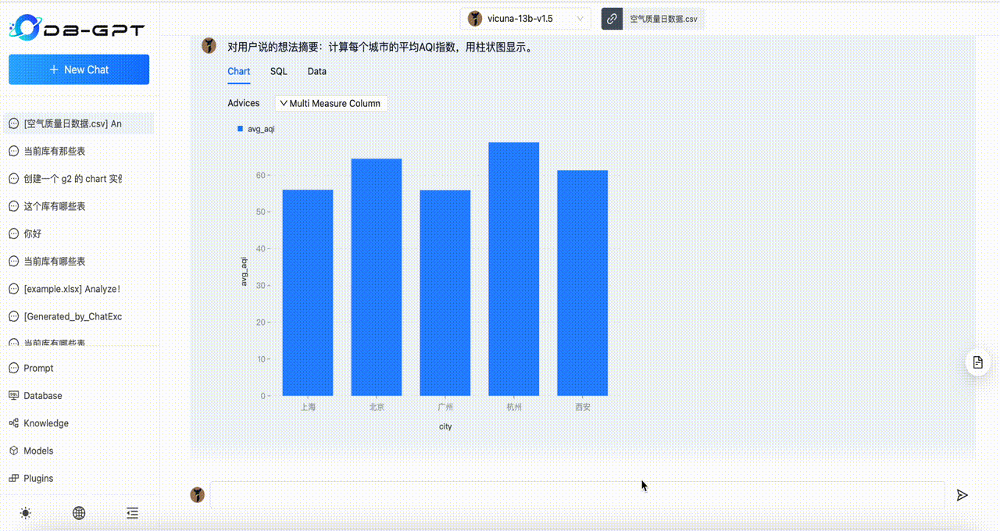
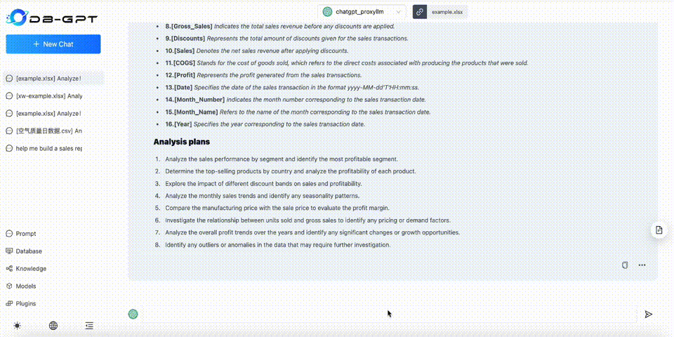

# 人工智能自研以及用于项目的可行性研究

核心问题：
1. 在行业专业领域，我们有的知识，来源于多年积攒的业内pdf文档和ppt文档，这些都能喂给大模型吗？
2. 我们将专业领域知识喂给大模型之后，是否大模型就能解答各种专业领域的问题？
3. 我们希望我提个问，大模型就能结合业务系统里面的数据给我一个答案，这个能做到吗？
4. 跟大模型对话用中文好用不？
5. 给大模型提问，除了能出文字，还能出图形报表吗？
6. 我们需要什么配置的机器？

## 结论1: 我们过去的文件都可以喂给大模型，能够做到针对喂养的文件提问的回答都能得到答案。

看看这个测试项目：https://github.com/zhaoqingpu/LangChainTest

其中将本地数据导入大模型的一段代码，几乎覆盖了普通人所有的文本来源和存储格式，很显然，这是通过程序读取文件中的文本，也就是说理论上，任何存储形式的文字都是可以喂给大模型：

再看看DB-GPT：
支持的文件语料文件类型和向量库：

采取什么形式喂的？

我们把代码pull下来看看：
1. text to vector，文本向量化入向量数据库Chroma

2. 加载向量库，加载大模型

## 结论2: 在垂直领域，可以做到中文友好

1. 看看如上测试项目中做Embeding向量化库以及加载Embeding模型的时候使用的模型，是中文库：

text2vec-base-chinese：

我们看看另外一个项目：https://github.com/eosphoros-ai/DB-GPT/blob/main/README.zh.md

[DB-GPT介绍视频](https://www.bilibili.com/video/BV1au41157bj/?spm_id_from=333.337.search-card.all.click&vd_source=7792e22c03b7da3c556a450eb42c8a0f)

text2vec-large-chinese：

2. 通过对DB-GPT的短时间实际测试，通过中文提问，中文回答，效果看起来很正常。

## 结论3: 我提个问，大模型能结合业务系统里面的数据给我一个答案

1. 首先，我们看DB-GPT整合的数据源支持：

2. 我们看看Text2SQL微调支持的模型和评测结果

基于第三方的这些尝试和结论，我们不难得出结论：“我提个问，大模型能结合业务系统里面的数据给我一个答案”，当然这也需要合适的预训练以及fine-tune，不能说效果就像人一样，但是一定会带来不少惊艳。

## 结论4: 给大模型提问，除了能出文字，也能出图形报表

严格来说，报表的数据是大模型出的，而报表的呈现程序是工程师事先写好的。看如下效果图：

## 结论5: 我们需要什么样的机器配置

1. 先说结论：

｜ 配置型号 | 配置要求 | 效果预计说明 |
| --- | --- | --- |
| 丐版 | CPU：8C、MEM：32G、GPU：RTX3090(24G)单卡 | 能够运行13B本地大模型，token少的时候还正常，token多的时候卡，token太多的时候卡到不出下文，不可全量训练大模型 |
| 能用版 | CPU：8C+、MEM：32G+、GPU：RTX3090Ti(24G)双卡 | 能稳定运行13B本地大模型，可能全量训练大模型，时间可能长达数周 |
| 可扩展版 |  CPU：8C+、MEM：32G、GPU：特斯拉V100(24G)双卡 | 能稳定运行13B本地大模型，可能全量训练大模型，并且可以增加显卡一起工作（需要主板买可插多卡的服务器版本）,增加显卡之后2个RTX3090数周完成的训练，可以缩减到几天完成 |
| 坑工程师版 |  CPU：8C、MEM：32G、GPU：RTX4090(24G)双卡 | RTX4090不支持显卡交火，也就是不支持nvlink技术，多个显卡之间没有高速通讯方案，结果是大于一块4090还不如3090 |
