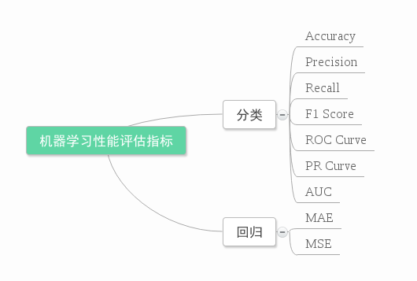

# 大模型评估

## 模型的效果评价

在机器学习、数据挖掘、推荐系统完成建模之后，需要对模型的效果做评价。

业内目前常常采用的评价指标有准确率(Precision)、召回率(Recall)、F值(F-Measure)等，下图是不同机器学习算法的评价指标。



### 有哪些模型评估方法？

- 准确率（Accuracy）：模型预测正确的样本数占总样本数的比例。
- 精确率（Precision）：模型预测为正的样本中，真正为正的样本数占所有预测为正的样本数的比例。
- 召回率（Recall）：模型预测为正的样本中，真正为正的样本数占所有实际为正的样本数的比例。
- F1-score：精确率和召回率的调和平均值。
- 损失函数（Loss function）：衡量模型预测值与真实值之间的差距。
- 均方误差（Mean Squared Error）：预测值与真实值之间的平方误差的平均值。
- 均方根误差（Root Mean Squared Error）：均方误差的平方根。
- 平均绝对误差（Mean Absolute Error）：预测值与真实值之间的绝对误差的平均值。
- R-平方（R-squared）：模型拟合度的度量。


### 如何选择模型评估方法？

- 对于分类问题，通常使用准确率、精确率、召回率、F1-score等指标。
- 对于回归问题，通常使用均方误差、均方根误差、平均绝对误差等指标。
- 对于多标签分类问题，通常使用平均精确率（Micro-averaged Precision）、平均召回率（Micro-averaged Recall）、F1-score等指标。
- 对于多输出分类问题，通常使用平均精确率（Macro-averaged Precision）、平均召回率（Macro-averaged Recall）、F1-score等指标。
- 对于多任务学习问题，通常使用平均精确率（Micro-averaged Precision）、平均召回率（Micro-averaged Recall）、F1-score等指标。
- 对于排序问题，通常使用准确率、精确率、召回率、F1-score等指标。
- 对于序列标注问题，通常使用准确率、精确率、召回率、F1-score等指标。
- 对于文本分类问题，通常使用准确率、精确率、召回率、F1-score等指标。
- 对于文本匹配问题，通常使用准确率、精确率、召回率、F1-score等指标。
- 对于图像分类问题，通常使用准确率、精确率、召回率、F1-score等指标。
- 对于图像分割问题，通常使用均方误差、均方根误差、平均绝对误差等指标。
- 对于对象检测问题，通常使用平均精确率（Micro-averaged Precision）、平均召回率（Micro-averaged Recall）、F1-score等指标。
- 对于语音识别问题，通常使用准确率、精确率、召回率、F1-score等指标。
- 对于推荐系统问题，通常使用准确率、精确率、召回率、F1-score等指标。
- 对于风险预测问题，通常使用均方误差、均方根误差、平均绝对误差等指标。
- 对于生物信息学问题，通常使用准确率、精确率、召回率、F1-score等指标。
- 对于其他问题，通常使用准确率、精确率、召回率、F1-score等指标。

### 什么是分布不平衡的数据集？

分布不平衡（imbalanced dataset）是指训练集、验证集、测试集中各类别样本的数量差异很大，导致模型在训练过程中偏向于预测少数类别样本，而忽略了多数类别样本。

常见的分布不平衡数据集有：

- 类别不平衡（class imbalance）：训练集、验证集、测试集中各类别样本的数量差异很大。
- 样本不平衡（sample imbalance）：训练集、验证集、测试集中各样本的数量差异很大。
- 长尾分布（long-tailed distribution）：训练集、验证集、测试集中各类别样本的数量差异很大，且存在某些类别样本数量极少。


　　倘若某人声称创建了一个能够识别登上飞机的恐怖分子的模型，并且准确率（accuracy）高达 99%。你相信吗？好了，有这么一个模型：将从美国机场起飞的所有乘客简单地标注为非恐怖分子。已知美国全年平均有 8 亿人次的乘客，并且在 2000-2017 年间共发现了 19 名恐怖分子，这个模型达到了接近完美的准确率——99.9999999%。尽管这个模型拥有接近完美的准确率，但是在这个问题中准确率显然不是一个合适的度量指标。

　　恐怖分子检测是一个不平衡的分类问题：我们需要鉴别的类别有两个——恐怖分子和非恐怖分子，其中一个类别代表了极大多数的数据点。                                                  

　　另一个不平衡分类问题出现在当疾病在公众中的发病率很低时的疾病监测。在这两种情况下，正例类别——疾病或恐怖分子，远远少于负例类别的数量。这种问题是数据科学中比较常见的例子，其中准确率并不是评估模型性能的很好的衡量标准。

　　直观地说，我们应该聚焦于正例（恐怖分子）的识别。


### 如何处理分布不平衡的数据集？

- 采样：对数据集进行采样，使各类别样本数量平衡。
- 过采样：通过对少数类别样本进行复制，使各类别样本数量平衡。
- 降采样：通过对多数类别样本进行删除，使各类别样本数量平衡。
- 权重调整：通过调整样本权重，使各类别样本数量平衡。
- 集成学习：通过集成多个模型，使各类别样本数量平衡。
- 其他方法：其他方法如SMOTE、ADASYN、BorderlineSMOTE等。
- 注意：处理分布不平衡的数据集时，应注意保持训练集、验证集、测试集的划分相同，以避免数据泄露。
- 注意：处理分布不平衡的数据集时，应注意选择合适的评估指标，以避免过度关注少数类别样本的性能。
- 注意：处理分布不平衡的数据集时，应注意选择合适的模型，以避免过度关注少数类别样本的性能。
- 注意：处理分布不平衡的数据集时，应注意选择合适的超参数，以避免过度关注少数类别样本的性能。
- 注意：处理分布不平衡的数据集时，应注意选择合适的模型架构，以避免过度关注少数类别样本的性能。
- 注意：处理分布不平衡的数据集时，应注意选择合适的特征工程，以避免过度关注少数类别样本的性能。
- 注意：处理分布不平衡的数据集时，应注意选择合适的正则化方法，以避免过度关注少数类别样本的性能。
- 注意：处理分布不平衡的数据集时，应注意选择合适的交叉验证方法，以避免过度关注少数类别样本的性能。
- 注意：处理分布不平衡的数据集时，应注意选择合适的学习率衰减策略，以避免过度关注少数类别样本的性能。
- 注意：处理分布不平衡的数据集时，应注意选择合适的正则化策略，以避免过度关注少数类别样本的性能。
- 注意：处理分布不平衡的数据集时，应注意选择合适的特征选择方法，以避免过度关注少数类别样本的性能。
- 注意：处理分布不平衡的数据集时，应注意选择合适的特征缩放方法，以避免过度关注少数类别样本的性能。
- 注意：处理分布不平衡的数据集时，应注意选择合适的特征提取方法，以避免过度关注少数类别样本的性能。
- 注意：处理分布不平衡的数据集时，应注意选择合适的特征转换方法，以避免过度关注少数类别样本的性能。
- 注意：处理分布不平衡的数据集时，应注意选择合适的特征降维方法，以避免过度关注少数类别样本的性能。
- 注意：处理分布不平衡的数据集时，应注意选择合适的特征选择方法，以避免过度关注少数类别样本的性能。
- 注意：处理分布不平衡的数据集时，应注意选择合适的特征融合方法，以避免过度关注少数类别样本的性能。
- 注意：处理分布不平衡的数据集时，应注意选择合适的特征选择方法，以避免过度关注少数类别样本的性能。


如何处理分布不平衡的数据集？

　　解决分布不平衡的数据集的方法有很多，下面介绍几种常见的方法：

1. 过采样：通过对少数类别的样本进行复制，使得数据集中每个类别的样本数目都达到平衡。

2. 过采样+欠采样：通过对少数类别的样本进行复制，使得数据集中每个类别的样本数目都达到平衡，同时通过对多数类别的样本进行删除，使得数据集中每个类别的样本数目都达到平衡。

3. 加权采样：通过对少数类别的样本进行复制，并给予其更高的权重，使得模型在训练时更关注少数类别的样本。

4. 加权欠采样：通过对少数类别的样本进行复制，并给予其更高的权重，使得模型在训练时更关注少数类别的样本，同时通过对多数类别的样本进行删除，使得数据集中每个类别的样本数目都达到平衡。

5. 半监督学习：通过人工标注少数类别的样本，使得模型在训练时更关注少数类别的样本。

6. 集成学习：通过将多个模型的预测结果进行集成，使得模型在训练时更关注少数类别的样本。

7. 迁移学习：通过使用预训练好的模型，使得模型在训练时更关注少数类别的样本。


## 评估行情的了解

1. LLM 实时排行，来自 UC伯克利：https://lmsys.org/blog/2023-06-22-leaderboard/


2. 选择中文模型：中文语言理解测评基准（CLUE）：https://www.cluebenchmarks.com/index.html 和SuperCLUE琅琊榜: https://www.superclueai.com/

开源领域 ChatGLM, LLAMA, RWKV 主要就是这3种模型，中文好一点就是 ChatGLM，潜力最好的就是LLAMA，RNN架构决定RWKV有很好的推理效率（随输入长度内存占比线性自增，而LLAMA则是指数增加）和 Length Extrapolation（关于长度外推性，可以参考苏神的文章）。当然 MPT-7B-StoryWriter-65k+模型也有较长的外推能力。

自ChatGPT为代表的大语言模型（Large Language Model, LLM）出现以后，由于其惊人的类通用人工智能（AGI）的能力，掀起了新一轮自然语言处理领域的研究和应用的浪潮。尤其是以ChatGLM、LLaMA等平民玩家都能跑起来的较小规模的LLM开源之后，业界涌现了非常多基于LLM的二次微调或应用的案例。下面这个项目在收集和梳理中文LLM相关的开源模型、应用、数据集及教程等资料，目前收录的资源已达100+个！

Awesome Chinese LLM，主要是整理开源的中文大语言模型，以规模较小、可私有化部署、训练成本较低的模型为主，包括底座模型，垂直领域微调及应用，数据集与教程等。

```
Awesome Chinese LLM #JGitHubitft: https://github.com/HqWu-HITCS/Awesome-Chinese-LLM
```


## 大模型评测数据集

### 中文大模型评测数据集

| 名称 | 网址 | 介绍 |
| --- | --- | --- |
| C-Eval | 源码：https://github.com/hkust-nlp/ceval  官网：https://cevalbenchmark.com/#home  使用教程：https://github.com/hkust-nlp/ceval/blob/main/README_zh.md | C-Eval是全面的中文基础模型评估套件，涵盖了52个不同学科的13948个多项选择题，分为四个难度级别。 <br> 通常你可以直接从模型的生成中使用正则表达式提取出答案选项（A,B,C,D)。在少样本测试中，模型通常会遵循少样本给出的固定格式，所以提取答案很简单。然而有时候，特别是零样本测试和面对没有做过指令微调的模型时，模型可能无法很好的理解指令，甚至有时不会回答问题。这种情况下我们推荐直接计算下一个预测token等于"A", "B", "C", "D"的概率，然后以概率最大的选项作为答案 -- 这是一种受限解码生成的方法，MMLU的官方测试代码中是使用了这种方法进行测试。注意这种概率方法对思维链的测试不适用。[更加详细的评测教程](https://cloud.tencent.com/developer/tools/blog-entry?target=https%3A%2F%2Fgithub.com%2Fhkust-nlp%2Fceval%2Fblob%2Fmain%2Fresources%2Ftutorial.md&source=article&objectId=2379575)。 |
| CMMLU | 源码：https://github.com/haonan-li/CMMLU  官网：  使用教程： |  CMMLU是一个综合性的中文评估基准，专门用于评估语言模型在中文语境下的知识和推理能力。CMMLU涵盖了从基础学科到高级专业水平的67个主题。它包括：需要计算和推理的自然科学，需要知识的人文科学和社会科学,以及需要生活常识的中国驾驶规则等。此外，CMMLU中的许多任务具有中国特定的答案，可能在其他地区或语言中并不普遍适用。因此是一个完全中国化的中文测试基准。<br><br> 涉及一些不是常见标准化考试类型的题目，例如食物，中国驾驶规范等。 <br><br> CMMLU 是一个包含了 67 个主题的中文评测数据集，涉及自然科学、社会科学、工程、人文、以及常识等，有效地评估了大模型在中文知识储备和语言理解上的能力。 |
| SuperCLUE | 源码：https://github.com/CLUEbenchmark/SuperCLUE  官网：  使用教程： | SuperCLUE是一个综合性大模型评测基准，本次评测主要聚焦于大模型的四个能力象限，包括语言理解与生成、专业技能与知识、Agent智能体和安全性，进而细化为12项基础能力。 |
| GAOKAO-Bench | 源码：https://github.com/OpenLMLab/GAOKAO-Bench  官网：  使用教程： | Gaokao 是一个中国高考题目的数据集，旨在直观且高效地测评大模型语言理解能力、逻辑推理能力的测评框架。<br><br> 收集了2010-2022年全国高考卷的题目，其中包括1781道客观题和1030道主观题，构建起GAOKAO-bench的主要评测数据。同时评测分为两部分，自动化评测的客观题部分和依赖于专家打分的主观题部分，这两部分结果构成了最终的分数，您可以通过构建示例中的脚本快速对一个已部署的大模型进行评测，或者向我们提交您需要评测的模型的主观题预测结果，进行我们人工评分的流水线操作。所有过程的数据和结果都是公开的。 |
| AGIEval | 源码：https://github.com/ruixiangcui/AGIEval  官网：  使用教程： | AGIEval 是一个用于评估基础模型在标准化考试（如高考、公务员考试、法学院入学考试、数学竞赛和律师资格考试）中表现的数据集。<br><br> AGIEval 是一个以人为中心的基准测试，专门用于评估基础模型在与人类认知和解决问题相关的任务中的一般能力。该基准源自 20 项针对普通人类考生的官方、公开和高标准的入学和资格考试，例如普通大学入学考试（例如，中国高考（高考）和美国 SAT）、法学院入学考试、数学竞赛、律师资格考试和国家公务员考试。有关基准测试的完整描述，请参阅我们的论文：AGIEval：评估基础模型的以人为本的基准。 |
|  | 源码：  官网：  使用教程： |  |
|  | 源码：  官网：  使用教程： |  |
|  | 源码：  官网：  使用教程： |  |
|  | 源码：  官网：  使用教程： |  |


.C-Eval：构造中文大模型的知识评估基准，其榜单是一个全面的中文基础 模型评估 套件（多层次、多学科的语文评价基础模型套件）。它由13948个选择题组成 问题跨越52个不同的学科和四个难度级 别，测试集用于模型评估（简单来说就是针对中文模型的综合测试机），目的是C-Eval能够帮助开发人员跟踪模型开发的进展，以及分析开发中模型的优点和弱
点。

C-Eval #GitHubttht: https://github.com/hkust-n|p/ceval,

论文地址：https://arxiv.org/pdf/2305.08322v1.pdf

