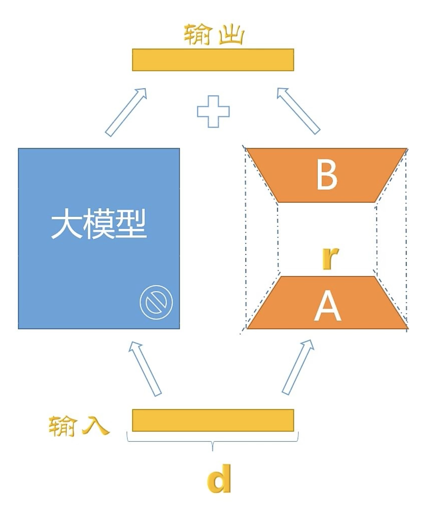

# 大模型训练方法

## 1. LoRA

LoRA(Low Rank Adaptation of Large Language Models)大语言模型的低秩自适应



LoRA的基本原理是：冻结预训练好的模型权重参数，额外增加一个旁路网络，旁路网络里，有一个降维矩阵A、一个升维矩阵B，用变量R来控制下降维度R越小整体参数量就会越小。拿本地知识只训练这个旁路网络，这样不仅微调的成本显著下降，还能获得和全模型微调类似的效果哦。尽管LoRA的参数量相对全模型参数已经减少很多，但即便是消费级硬件，没几块4090还是很难玩得起来。有没有更轻量级的方法呢？当然有。最近比较活跃的开源项目LlamaIndex和LangChain就是更轻量级的方法。
```
 我们在和模型对话的时候， 不仅能在提问中添加背景知识，模型还能联系对话上文综合评估生成更准确的回答。LlamaIndex和LangChain就是利用这一点不需要微调模型，只把本地知识库相关信息通过Prompt传递给模型，让模型能够读取理解本地知识，这样就能给出更贴近你本地知识的回答
```

## 2. 蒸馏

蒸馏(Distillation)是一种模型压缩技术，通过将一个大的模型压缩到一个小型的模型，来达到模型压缩的目的。蒸馏的主要思想是通过让一个大的模型学习到一个小型的模型的输出，从而达到模型压缩的目的。具体来说，蒸馏的训练过程如下：

1. 首先，训练一个大的模型，如BERT。
2. 然后，使用一个小型的模型，如GPT-2，来学习大型模型的输出。
3. 最后，使用蒸馏损失函数，使得小型模型的输出和大型模型的输出尽可能相似。


蒸馏的优点是能够有效地压缩模型大小，且能够学习到大型模型的长-范围的语义信息。