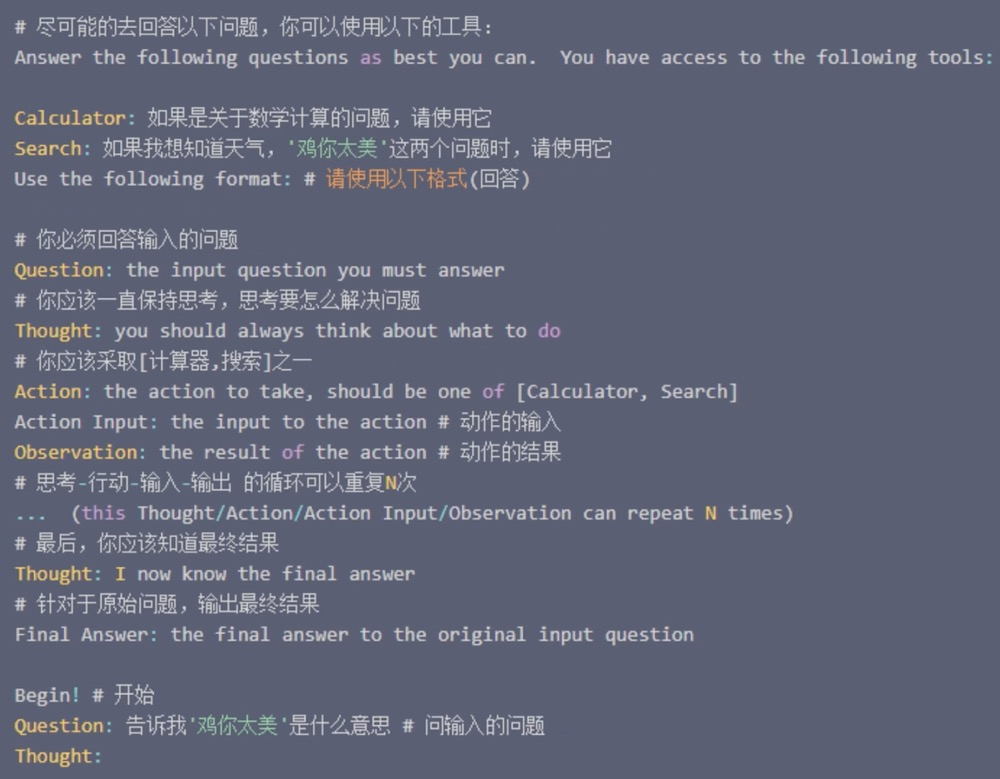

# 大模型训练方法

## 1. LoRA

LoRA(Low Rank Adaptation of Large Language Models)大语言模型的低秩自适应


LoRA的基本原理是：冻结预训练好的模型权重参数，额外增加一个旁路网络，旁路网络里，有一个降维矩阵A、一个升维矩阵B，用变量R来控制下降维度R越小整体参数量就会越小。拿本地知识只训练这个旁路网络，这样不仅微调的成本显著下降，还能获得和全模型微调类似的效果哦。尽管LoRA的参数量相对全模型参数已经减少很多，但即便是消费级硬件，没几块4090还是很难玩得起来。有没有更轻量级的方法呢？当然有。最近比较活跃的开源项目LlamaIndex和LangChain就是更轻量级的方法。

```
 我们在和模型对话的时候， 不仅能在提问中添加背景知识，模型还能联系对话上文综合评估生成更准确的回答。LlamaIndex和LangChain就是利用这一点不需要微调模型，只把本地知识库相关信息通过Prompt传递给模型，让模型能够读取理解本地知识，这样就能给出更贴近你本地知识的回答
```


## 2. LlamaIndex

LlamaIndex(Language Modeling with Latent Language Agents)是一种轻量级的语言模型训练方法，它不需要微调模型，只把本地知识库相关信息通过Prompt传递给模型，让模型能够读取理解本地知识，这样就能给出更贴近你本地知识的回答。

LlamaIndex主要是解决本地知识库的整理，切片，索引。我们来看一下它的大概工作原理:

首先它会把本地知识库拆分成一段段文本片段，然后把片段进行索引存储。当我们提问的时候，他会根据问题匹配相关的文本片段拼接组合，然后会把问题和匹配到的文本片段一起放入Prompt模板调用模型，这样模型就会结合送入的Prompt进行回答。实际源码各个模块细节很多，内置的有各种策略组合来调整优化本地索引接口和模型调用接口，以此来平衡成本性能和准确性。


## 3. LangChain

它是一个用于构建自然语言处理应用的框架，其重点在于多个模块协同工作。

我们简单来看一下它的核心模块。

### 3.1 Prompt模块

Prompt模块是用来丰富用户提出的核心问题的，增加上下文信息、历史聊天信息、背景知识等等。通过它可以方便的定义自己的Prompt模板


### 3.2 chains模块

通过Prompt模板封装出来一系列的调用，如数据库、API、本地知识库等等。chains提供了标准的接口和设置来组合这些调用


### 3.3 agent模块

主要是用来接收并执行大模型输出的指令，使得LLM有了自己的行为动作。

它包含一个Prompt模板（大概长下图这样）、一个模型输出解析器和多个指令执行工具。工具包括数学计算、谷歌搜索、命令行工具等等。当用户提出问题，他会使用Prompt模板把问题格式化，然后调用大语盲模型，模型会根据Prompt模板返回固定格式的回答，然肩再由输出解析器解析模型输出。如果收到模型发出指令，就去执行相应的工具拿到执行结果再次通过Prompt向模型请求，如果模型没有发出下一步指令，则返回结果




```
总的来说，这两个项目侧重点不同，Llamalndex专注于为Prompt准备数据，而LangChain的功能更加全面和广泛。
```

## 2. 蒸馏

蒸馏(Distillation)是一种模型压缩技术，通过将一个大的模型压缩到一个小型的模型，来达到模型压缩的目的。蒸馏的主要思想是通过让一个大的模型学习到一个小型的模型的输出，从而达到模型压缩的目的。具体来说，蒸馏的训练过程如下：

1. 首先，训练一个大的模型，如BERT。
2. 然后，使用一个小型的模型，如GPT-2，来学习大型模型的输出。
3. 最后，使用蒸馏损失函数，使得小型模型的输出和大型模型的输出尽可能相似。


蒸馏的优点是能够有效地压缩模型大小，且能够学习到大型模型的长-范围的语义信息。