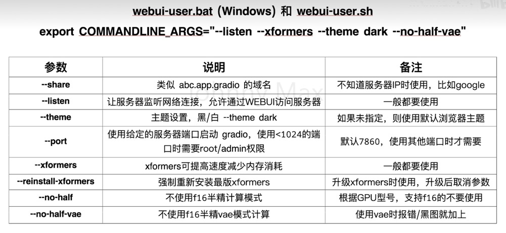
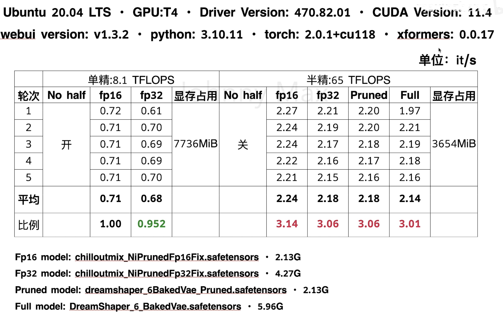

# Stable Diffusion

1. 汉化

双语插件
https://github.com/journey-ad/sd-webui-bilingual-Localization

中文语言包
https://github.com/dtlnor/stable-diffusion-webui-localization-zh_CN

2. 启动

```
nohup./webui.sh -listen --enable-insecure-extension-access -xformers -no-half-vae
```

nohup：是一个命令，用于在运行命令时忽略 Hangup（挂起）信号，即使终端关闭或断开连接，也能保持命令继续运行。

webui.sh： 是stable diflusion的启动脚本。

--listen，--no-half-vae都是参数，关于参数的说明可以到我的另一个视频中了解：《Stable Diffusion fp16（半精）vs fp.32（单精），Pruned model vs Full mod，出图速度对比，图片质量对比》&：是一个特殊符号，用于将命令放在后台运行，使终端可以继续输入其他命令。

tail -† nohup.out

tall： 用于显示文件的末尾内容。f：是"Yollw”的缩写，用于实时追踪文件的变化。

3. 参数和对比

fp16（半精计算模式）、fp32（单精计算模式）
fp16 model（半精模型）、fp32 model（单精模型）
Pruned model(裁剪模型) 、 Full model (完整模型)



