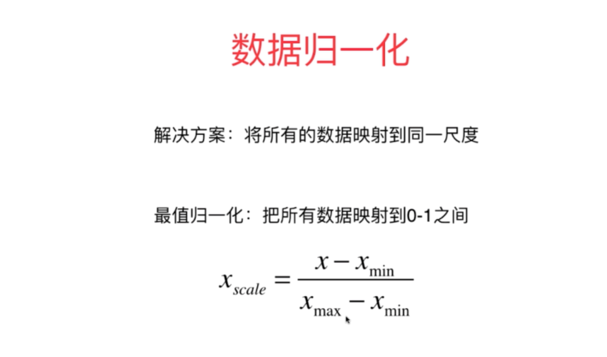
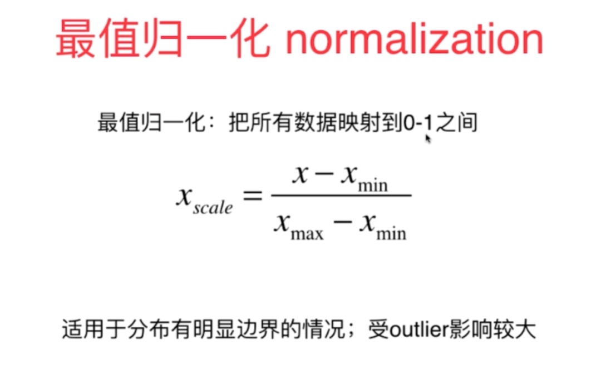
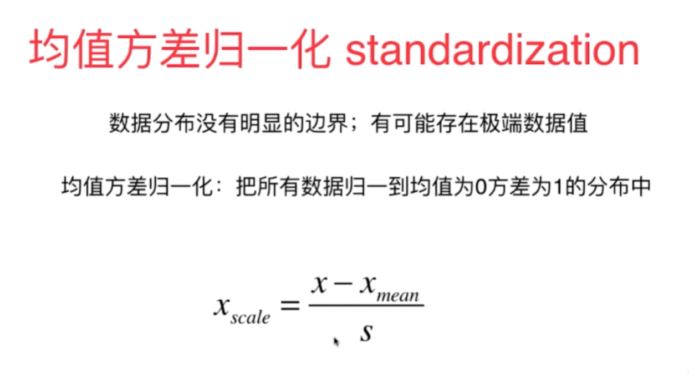

# Text-Speech Conversion Q&A

## Questions:  

1.什么是量纲，什么是无量纲量？

2.鲁棒性和稳定性的区别？

3.什么是方差？

4.什么是归一化？最值归一化？均值方差归一化？

5.什么是梅尔刻度？

6.什么是谱？什么是声音的频谱图？什么是梅尔频谱图（mel-spectrogram）？

7.赫兹的定义？

8.什么是声音的采样位深度？

9.声音的属性有哪些？

10.举例说明什么是音调、响度、音色？分别结合时域振幅图像、频域振幅图像说明什么是音调、响度、音色。

11.傅里叶变换有哪些应用领域？

12.什么是高通滤波？什么是低通滤波？

13.如何用声音表现函数？

14.音频文件常见采样率？

15.什么是GAN、FLOW、VAE？

16.解释什么是GPT模型？

17.什么是自回归模型？

18.什么是注意力机制，什么是多头注意力机制？

19.构造一个图片高通滤波器、低通滤波器的过程？

20.什么是复数？

21.如何将复数的numpy数组映射成[0,255]的正数数组？

22.什么是“香农采样定理”？

## Answers

1. 量纲：量纲是指数据单位的度量，是指数据在不同单位之间的换算关系。比如，长度单位是米，那么1米等于多少英里、公里、里程？

2. 鲁棒性：

3.  

4. 
   
   

   

   

5.  

6.  

7.  

8. 声音的采样位深度：声音的采样位深度是指声音信号在存储或传输时所占的位数，通常为8、16、24、32、64位。是数字音频技术中的一个重要参数，它代表了取样中对声音强度记录的精细程度，也可以理解为量化精度。采样位深度决定了每个采样点能够表示的声音强度级别的数量，这个数值越大，表示解析度越高，录制和回放的声音就越真实。在电脑中，声音文件是用数字0和1来表示的。连续的模拟信号经过数码脉冲取样后，每个离散的脉冲信号被以一定的量化精度量化成一串二进制编码流。这串编码流的位数即为采样深度，它直接影响了声音文件的音质和信噪比，即声音从最小声到最大声之间的密度格子数。格子越密，采样位深越大，噪声频率越高、噪声音量越小，从而减少了声音的失真‌12。

简单来说，采样位深度是衡量声音数字化过程中精度的一个指标，它决定了数字声音文件的品质。较高的采样位深度能够更精确地捕捉和还原原始声音的细微差别，提供更好的音质体验。

9. 声音的属性有：声音的频率、响度、音色、音调。

10.  

11. 傅里叶变换有两个应用领域：信号处理和音频处理。

12. 高通滤波器：高通滤波器是指频率响应在频率超过某个阈值的地方增大，在频率低于某个阈值的地方减小，其余部分保持不变。

13. 声音表现函数：声音表现函数是指声音信号在不同频率下的能量分布，它反映了声音的频谱特性。  

14. 常见的音频文件采样率有：8kHz、16kHz、44.1kHz、48kHz、96kHz、192kHz。

15. GAN、FLOW、VAE：GAN是一种生成模型，它可以生成与训练数据相似的新数据。FLOW是一种无监督学习方法，它可以学习到数据的潜在结构。VAE是一种变分自编码器，它可以学习到数据的潜在结构和生成分布。

16. GPT模型：GPT模型是一种基于transformer的语言模型，它可以生成文本。

17. 自回归模型：自回归模型是指时间序列数据中存在一定的相关性，即当前时刻的预测值等于前一时刻的真实值。

18. 注意力机制：注意力机制是一种基于注意力的神经网络层，它可以帮助模型学习到输入数据的重要性。

19. 构造一个图片高通滤波器、低通滤波器的过程：首先，需要确定滤波器的类型，高通或低通。然后，确定滤波器的截止频率，即滤波器的最高频率。确定滤波器的中心频率，即滤波器的最低频率。确定滤波器的带宽，即滤波器的频率范围。确定滤波器的阶数，即滤波器的阶数。最后，将滤波器的设计图形化，并将滤波器的频率响应图形化。

20. 复数：复数是指两个实数的实部和虚部的结合。

21. 将复数的numpy数组映射成[0,255]的正数数组：将复数的numpy数组映射成[0,255]的正数数组的方法是将复数的实部和虚部分别除以最大值，然后乘以255，再加上127。

22. “香农采样定理”：香农采样定理是信号处理中的一个基本原理，它指出为了从离散的采样点中无失真地重建原始连续信号，采样频率必须至少是信号中最高频率成分的两倍。这个定理确保了在采样过程中不会发生频谱混叠，即高频信号的成分不会被错误地解释为低频信号。简单来说，如果一个信号的最高频率是f_max，那么采样频率f_s应该满足f_s ≥ 2f_max。这个原则是连接连续信号与离散信号处理的桥梁，广泛应用于音频、图像和通信等领域。虽然理论上要求是两倍，但在实际应用中，为了安全和更好的重建质量，通常会采用更高的采样率。