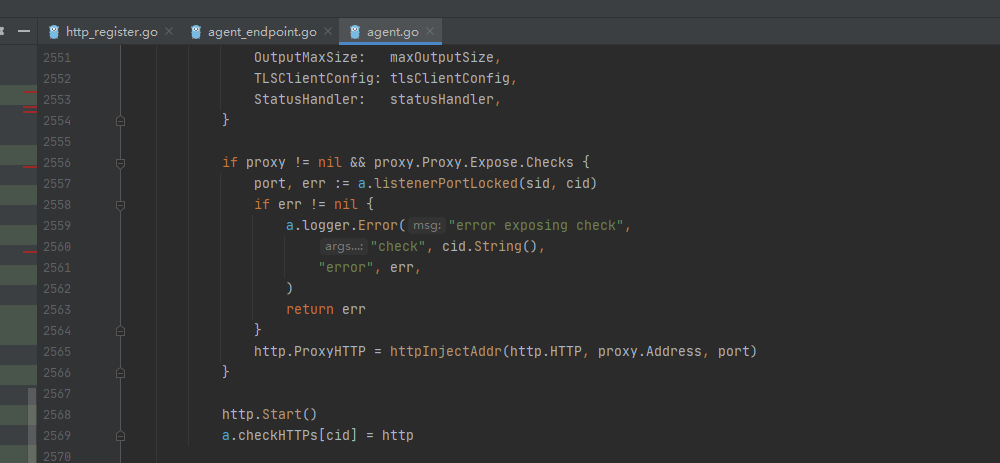

# consul健康检查源码分析一（http+interval模式）


说明

网上关于consul健康检查的说明有很多，基本都是根据官方文档的说明来的，基本上就是一下几种。

Script+ Interval

HTTP+ Interval

TCP+ Interval

Timeto Live（TTL）

Docker+ interval

本文根据consul源码来分析整个过程，来看一下具体的是怎么实现的。
是用的源码为consul-1.9.5的源码

从api注册接口流程中查看check的配置，来梳理整个流程

```
agent/http_register.go 程序入口,找到agent注册的代码
```


```
agent/agent_endpoint.go 接口实现，新增服务的话走AddService逻辑
```

  

```
agent/agent.go 调用顺序是：AddService->addServiceLocked->addServiceInternal，最后进入到addCheck
```


```
agent/agent.go addCheck里面有一个switch语句，来根据你传的参数看你是哪种健康检查
```


```
以http+interval为例，它最终会配置一个http.Start()
```



```
agent/checks/check.go 最终会启一个协程，它会根据interval时间来启动一个定时任务，
```


```
定时任务里面会有一个check()函数，它用来判断应用的状态。
```

创建http失败会直接更新应用的status


http发送异常会更新status为critical   
发送200更新status为passing   
发送429更新status为warning   
其余情况更新status为critical   


```
以上就是健康检查的基本逻辑，其他类型的逻辑与其类似，ttl上报的这种是应用主动发起请求到consul的check/pass接口中。这块下次在分析源码。
```


以上是consul健康检查的简单分析过程.