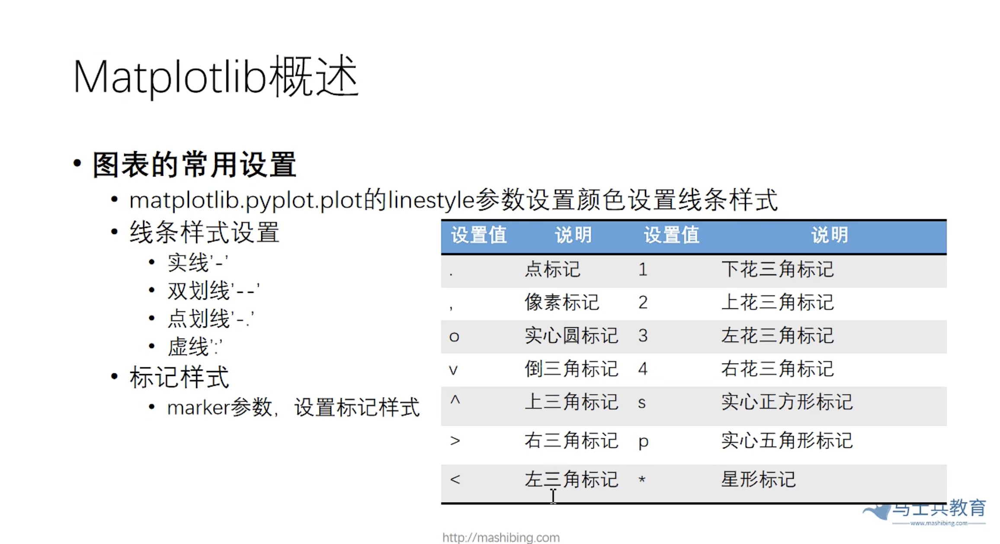
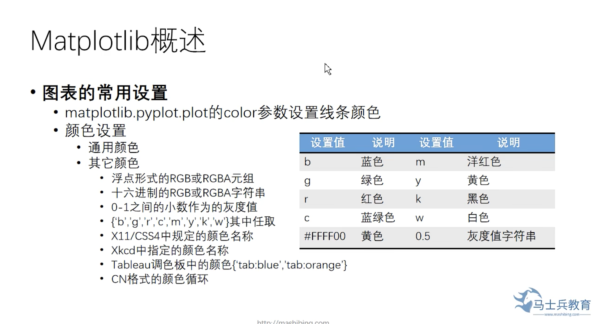
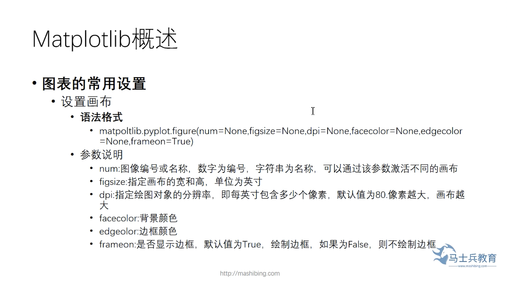
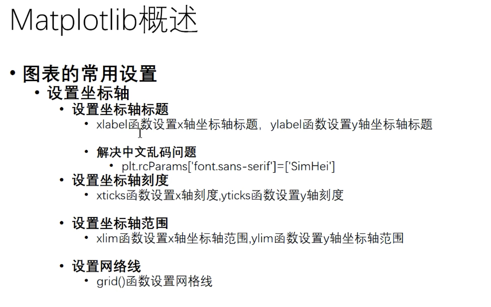
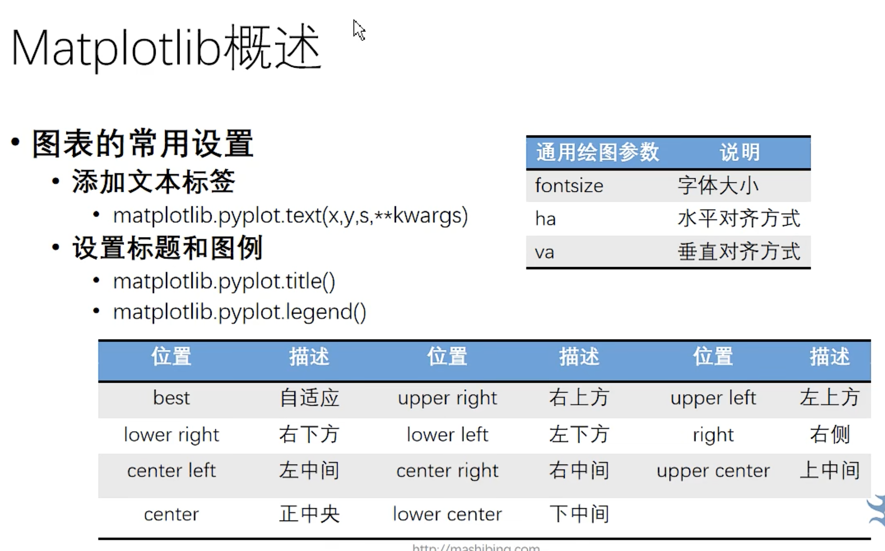

# python 数据可视化

## Matplotlib的安装

```
pip install matplotlib
```

## Matplotlib三步绘制图表

1. 引入pyplot模块
2. 使用Matplotlib模块的plot方法绘制图表
3. 运行程序

示例代码： 
```
import matplotlib.pyplot as plt

plt.plot([1, 2, 3, 4, 5, 6, 7, 8, 9, 10])
plt.show()
```

## 图表的常用设置

* linestyle
* color
* marker
* markerfacecolor




### matplotilb.pyplot.plot的linestyle参数设置颜色设置线条样式
1. 线条样式设置
    * 实线'-'
    * 双划线'--'
    * 点划线'-.'
    * 虚线':'
2. 标记样式
    * marker参数，设置标记样式

示例代码：
```
# 散点图，
import matplotlib.pyplot as plt
import pandas as pd

df = pd.read_csv('./data/bike-sharing-demand/train.csv')
x = df['datetime'][0:10]
y = df['temp'][0:10]
# plt.plot(x, y, 'ro', color='black')
# plt.plot(x, y, 'bv', color='black')
# plt.plot(x, y, 'bv') # 这里的'bv'中b代表blue，v代表下三角形状
# plt.plot(x, y, 'bo')
# plt.plot(x, y, marker='o')
# plt.plot(x, y, marker='o', color='red')
plt.plot(x, y, marker='o', color='red', markerfacecolor='w') # markerfacecolor可以简写成mfc
plt.plot(x, y, marker='o', color='red', mfc='white') # markerfacecolor可以简写成mfc
plt.show()

```

### matplotlib.pyplot.plot的color参数设置线条顔色



1. 通用颜色
2. 其它颜色
    * 浮点形式的RGB或RGBA元组
    * 十六迸制的RGB或RGBA字符串
    * 0-1之间的小数作为的灰度值
    * {'b', 'g', 'r', 'c','m', 'y', 'k', 'w'}其中任取
    * X11/CSS4中規定的顔色名称
    * Xkcd中指定的顔色名称
    * Tableau調色板中的顔色{tab:blue'tab:orange'}
    * CN格式的颜色循环

示例代码：
```
# 线条颜色和样式
import matplotlib.pyplot as plt

# # 折线图
# plt.plot([1, 2, 3, 4, 5, 6, 7, 8, 9, 10])
# plt.show()

# plt.plot([1, 2, 3, 4, 5], [3,9,10,2,5])
# plt.show()

# # 散点图
# plt.plot([1, 2, 3, 4, 5], [3,9,10,2,5], 'ro')
# plt.show()

# # 绘制简单折线
# x = range(1, 15, 1)
# y = range(1, 42, 3)
# print(list(x))
# plt.plot(x, y,)
# plt.show()

# 绘制未来15天天气预报折线图
import pandas as pd
import matplotlib.pyplot as plt
df = pd.read_csv('./data/bike-sharing-demand/train.csv')
# print(df.head())
x = df['datetime'][0:10]
y = df['temp'][0:10]
plt.plot(x, y, color='0.1', linestyle='-.')
y = df['temp'][20:30]
plt.plot(x, y, color='pink', linestyle='--')
y = df['temp'][10:20]
# plt.plot(x, y, color='r')
# plt.plot(x, y, color='0.1') # 0到1之间设置的是灰度值
# plt.plot(x, y, color='#ffff00')
plt.plot(x, y, color='0.1', linestyle=':')
plt.show()
```

## 画布设置



示例代码：

```
# 散点图，
import matplotlib.pyplot as plt
import pandas as pd

df = pd.read_csv('./data/bike-sharing-demand/train.csv')
x = df['datetime'][0:10]
y = df['temp'][0:10]
# plt.plot(x, y, 'ro', color='black')
# plt.plot(x, y, 'bv', color='black')
# plt.plot(x, y, 'bv') # 这里的'bv'中b代表blue，v代表下三角形状
# plt.plot(x, y, 'bo')
# plt.plot(x, y, marker='o')
# plt.plot(x, y, marker='o', color='red')
plt.figure(facecolor='yellow', figsize=(15,6))
plt.plot(x, y, marker='o', color='red', markerfacecolor='w') # markerfacecolor可以简写成mfc
y = df['temp'][10:20]
plt.plot(x, y, marker='o', color='red', mfc='white') # markerfacecolor可以简写成mfc
plt.show()

```

## 设置坐标轴和网格线



示例代码：
```
# 散点图，
import matplotlib.pyplot as plt
import pandas as pd

df = pd.read_csv('./data/bike-sharing-demand/train.csv')
x = df['datetime'][0:10]
y = df['temp'][0:10]
plt.rcParams['font.sans-serif'] = 'SimHei'
plt.figure(facecolor='yellow', figsize=(15,6))
plt.xlabel('time')
plt.ylabel('温度')
plt.plot(x, y, marker='o', color='red', markerfacecolor='w') # markerfacecolor可以简写成mfc
y = df['temp'][10:20]
plt.plot(x, y, marker='o', color='red', mfc='white') # markerfacecolor可以简写成mfc
plt.show()

```

示例代码：
```
# 坐标轴刻度
import matplotlib.pyplot as plt
import random

x = [i for i in range(1,11)] # 列表生成式
y = [random.randint(1,10) for _ in range(1,11)]
plt.rcParams['font.sans-serif'] = 'SimHei'
plt.plot(x,y, marker='o', mfc='w')
month = [str(i) + '月' for i in range(1,11)]
plt.xticks(range(1,11), month) # 设置x轴坐标轴刻度
plt.yticks(range(1,11)) # 设置y轴坐标轴刻度
plt.show()
```

示例代码：
```
import matplotlib.pyplot as plt
import random

x = [i for i in range(1,11)] # 列表生成式
y = [random.randint(1,10) for _ in range(1,11)]
plt.rcParams['font.sans-serif'] = 'SimHei'
plt.plot(x,y, marker='o', mfc='w')
month = [str(i) + '月' for i in range(1,11)]
plt.xticks(range(1,11), month) # 设置x轴坐标轴刻度
plt.yticks(range(1,11)) # 设置y轴坐标轴刻度
plt.ylim(1,12)
plt.xlim(1,12)
# plt.grid(color='0.5', linestyle='--', linewidth=2)
# plt.grid(color='0.5', linestyle='--', linewidth=2, axis='x') # 隐藏x轴网格线
plt.grid(color='0.5', linestyle='--', linewidth=1, axis='y') # 隐藏x轴网格线
plt.show()
```

## 添加文本标签



示例代码：
```

```