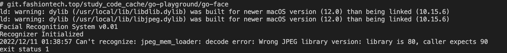

# go-face人脸识别踩坑记

使用封装了 dlib 机器学习工具包的 kagami/go-face 包，极大简化了我们进行人脸识别的过程。

### dlib 工具包

它是用 C++ 构建的，它在面部识别与检测方面都令人惊奇。根据它的文档，在 Wild 基准测试中检测标记面部的准确度约为 99.4%，这难以置信，也是为什么许多第三方库将其作为基础的原因

#### 安装

我不想撒谎，让它启动并运行起来比用标准的 Go 包更痛苦一些，你需要在计算机上安装 pkg-config 和 dlib。如果你在 MacOS 上运行，命令如下：

```
$ brew install pkg-config dlib
$ sed -i '' 's/^Libs: .*/& -lblas -llapack/' /usr/local/lib/pkgconfig/dlib-1.pc
```

### 开始

我们首先需要下载 kagami/go-face 包，可以使用如下 go get 命令：
```
$ go get -u github.com/Kagami/go-face
```

在你的 GOPATH 目录中创建一个名为 go-face-recognition 的新目录。在此目录中创建一个名为 main.go 的文件，这是我们所有源码所在位置。

完成操作后，你需要从 TutorialEdge/ go-face-recognition-tutorial repo 的 image/ 目录中获取文件。最简单的方法是 clone repo 到另一个目录，只需复制图片目录到当前的工作目录

```
$ git clone https://github.com/TutorialEdge/go-face-recognition-tutorial.git
```

一旦成功 clone 后，我们就有了启动人脸识别的所需的 .dat 文件。你应该还看到一些其他包含复仇者联盟面孔的 .jpg 文件列表。

```
package main

import (
    "fmt"

    "github.com/Kagami/go-face"
)

const dataDir = "testdata"

func main() {
    fmt.Println("Facial Recognition System v0.01")

    rec, err := face.NewRecognizer(dataDir)
    if err != nil {
        fmt.Println("Cannot INItialize recognizer")
    }
    defer rec.Close()

    fmt.Println("Recognizer Initialized")
}
```

好的，如果我们尝试在这时候运行程序，应该会在我们程序的输出中看到 Facial Recognition System v0.01 和 Recognizer Initialized. 我们已经成功的设置了所需的一切，为了做一些很酷的高级人脸识别！

#### 坑

当你运行了go run .之后，出现如下画面：



```
2022/12/11 01:38:57 Can't recognize: jpeg_mem_loader: decode error: Wrong JPEG library version: library is 80, caller expects 90
```

翻译过来就是识别到系统中安装的库为80，但是程序需要90的库。

在网上搜了一下别人的解决方法，还发现有人振振有词的翻译反了，说是要80但是系统中是90。。。

在Mac中最简单的安装libmpeg的方法如下：

```
brew install libjpeg
```

但是像这样安装之后，并不能改变程序识别到的libjpeg为90。

于是多样尝试之后，决定直接安装libjpeg。

1. 下载http://www.ijg.org/files/jpegsrc.v9e.tar.gz
2. 解压后，从终端进入到 libjpeg 所在目录，用常规方法既可安装，命令如下：

```
./configure
make
make install
＃make test
```

最后一条命令make test是用来测试这个库是否安装成功的，执行这个命令后，你会看到 libjpeg 解压后所在目录下多了几张图片等，就是这个命令生成的。最后还可以用 make clean 来清理一些临时文件。

说明

如果没有执行 make install 命令或者执行失败，则使用该库的程序在运行时，可能无法链接到相应的库，会出现error while loading shared libraries: libjpeg.so.8 Not found之类的错误！！

用直接安装的方法，装哪个版本，程序识别到的就是哪个版本，自此问题解决。

#### 坑

找不到mmod_human_face_detector.dat

rec, err := face.NewRecognizer(dataDir), 创建Recognizer需要在指定的文件夹下面包含dlib_face_recognition_resnet_model_v1.dat, shape_predictor_5_face_landmarks.dat, mmod_human_face_detector.dat三个文件，而从https://github.com/TutorialEdge/go-face-recognition-tutorial.git下载的包缺少mmod_human_face_detector.dat文件。

mmod_human_face_detector.dat是训练好的模型，可以从这里下载：

http://dlib.net/files/mmod_human_face_detector.dat.bz2

