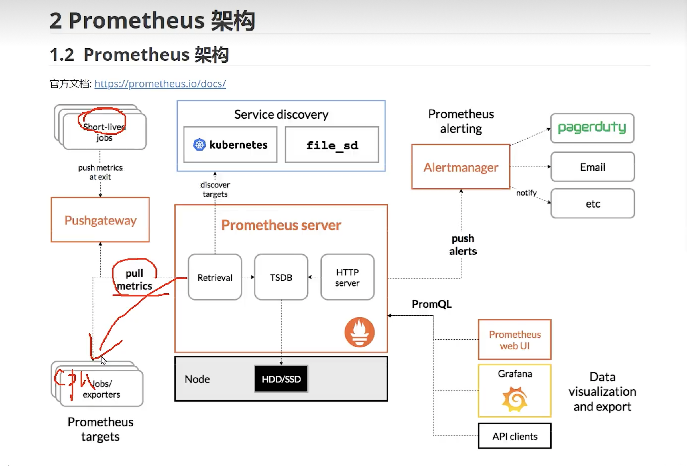

# Prometheus

在微服务架构中，监控是非常重要的一环。它可以帮助开发者及时发现和解决系统问题，提高系统的稳定性和可靠性。而在 go 语言中，go-kit 框架提供了 prometheus 监控指标来方便用户监测微服务的运行状态。

本文将介绍 go-kit 中如何使用 prometheus 监控指标，并给出一些示例代码帮助读者理解这些概念。




### 1. 什么是 prometheus

prometheus 是一个开源的监控系统和时间序列数据库。它广泛应用于云原生领域，能够帮助开发者收集和存储各种类型的监控数据，并提供丰富的查询和可视化功能。

prometheus 采用 pull 方式获取监控数据，即通过 HTTP 请求周期性地获取被监控对象产生的数据，并存储到本地时间序列数据库中。同时，它还支持多种方式导出数据（例如 Grafana、Alertmanager 等），方便开发者对系统进行实时分析和预警处理。

### 2. go-kit 中的 prometheus 监控指标

go-kit 提供了 prometheus 包来实现自定义度量指标。通过该包，我们可以轻松地创建各种度量器（例如计数器、直方图等），并将其与 HTTP 处理器、RPC 服务等绑定起来。

以下是一个示例代码，它演示了如何使用 go-kit 的 prometheus 包实现自定义计数器：

```
// 创建度量器对象。
var (
    requests = prometheus.NewCounter(
        prometheus.CounterOpts{
            Name: "example_requests_total",
            Help: "The total number of requests to the example service.",
        })
)
 
func main() {
    // 注册度量器到默认的注册表中。
    r := prometheus.NewRegistry()
    r.MustRegister(requests)
 
    // 创建路由和中间件。
    r := mux.NewRouter()
    r.Use(promhttp.HandlerFor(r, promhttp.HandlerOpts{}).ServeHTTP)
 
    // 注册服务端点。
    svc := stringService{}
    e := endpoints.Endpoints{
        UppercaseEndpoint: endpoints.MakeUppercaseEndpoint(svc),
        CountEndpoint:     endpoints.MakeCountEndpoint(svc),
    }
 
	// 将服务端点注册到路由器上，并在处理请求时更新计数器值。
	r.Path("/uppercase").Methods("GET").Handler(kithttp.NewServer(
	    e.UppercaseEndpoint,
	    decodeUppercaseRequest,
	    encodeResponse,
	    options...,
	)).Before(countRequests)
	r.Path("/count").Methods("POST").Handler(kithttp.NewServer(
	    e.CountEndpoint,
	    decodeCountRequest,
	    encodeResponse,
	    options...,
	)).Before(countRequests)
 
	// 启动 HTTP 服务器，并将监控指标暴露给 Prometheus 拉取。
	http.Handle("/metrics", promhttp.HandlerFor(r, promhttp.HandlerOpts{Registry: r}))
	http.ListenAndServe(":8080", nil)
}
 
// 自定义中间件，用于更新计数器值。
func countRequests(next http.Handler) http.Handler {
    return http.HandlerFunc(func(w http.ResponseWriter, r *http.Request) {
        requests.Inc()
        next.ServeHTTP(w, r)
    })
}

```

在这个例子中，我们首先创建了一个名为 requests 的计数器对象。然后，我们将其注册到默认的 prometheus 注册表中，并使用 promhttp.HandlerFor 方法将监控指标暴露给 Prometheus 拉取。

接着，我们创建了一个自定义中间件 countRequests，用于在每次处理请求时更新计数器值。最后，我们通过 kithttp.NewServer 方法将服务端点绑定到对应的 URL 上，并在请求处理之前调用该中间件。

### 3. prometheus 度量器类型

除了计数器外，prometheus 还提供了多种度量器类型。下面是一些常见的度量器类型及其简要说明：

* 计数器（Counter）：递增的整数或浮点型值。
* 直方图（Histogram）：统计数据分布情况，包括采样数据、桶和累积值等。
* 摘要（Summary）：类似于直方图，但摘要只保留具有固定大小窗口的样本。

以下是一个示例代码，它演示了如何使用 go-kit 的 prometheus 包实现自定义直方图：

```
// 创建度量器对象。
var (
    requestLatency = prometheus.NewHistogramVec(
        prometheus.HistogramOpts{
            Name: "example_request_latency_seconds",
            Help: "The latency of requests to the example service.",
            Buckets: []float64{0.1, 0.5, 1, 2.5, 5},
        },
        []string{"method", "path"},
    )
)
 
func main() {
    // 注册度量器到默认的注册表中。
    r := prometheus.NewRegistry()
    r.MustRegister(requestLatency)
 
    // 创建路由和中间件。
    r := mux.NewRouter()
    r.Use(promhttp.HandlerFor(r, promhttp.HandlerOpts{}).ServeHTTP)
 
    // 注册服务端点。
    svc := stringService{}
    e := endpoints.Endpoints{
        UppercaseEndpoint: endpoints.MakeUppercaseEndpoint(svc),
        CountEndpoint:     endpoints.MakeCountEndpoint(svc),
    }
 
	// 将服务端点注册到路由器上，并在处理请求时更新直方图数据。
	r.Path("/uppercase").Methods("GET").Handler(kithttp.NewServer(
	    e.UppercaseEndpoint,
	    decodeUppercaseRequest,
	    encodeResponse,
	    options...,
	)).Before(recordRequestLatency("GET", "/uppercase"))
	r.Path("/count").Methods("POST").Handler(kithttp.NewServer(
	    e.CountEndpoint,
	    decodeCountRequest,
	    encodeResponse,
	    options...,
	)).Before(recordRequestLatency("POST", "/count"))
 
	// 启动 HTTP 服务器，并将监控指标暴露给 Prometheus 拉取。
	http.Handle("/metrics", promhttp.HandlerFor(r, promhttp.HandlerOpts{Registry: r}))
	http.ListenAndServe(":8080", nil)
}
 
// 自定义中间件，用于记录请求的响应时间。
func recordRequestLatency(method, path string) Middleware {
    return func(next http.Handler) http.Handler {
        return http.HandlerFunc(func(w http.ResponseWriter, r *http.Request) {
            start := time.Now()
            next.ServeHTTP(w, r)
            requestLatency.WithLabelValues(method, path).Observe(time.Since(start).Seconds())
        })
    }
}
```

在这个例子中，我们创建了一个名为 requestLatency 的直方图对象，并使用 prometheus.HistogramOpts 定义其桶范围。然后，我们将其注册到默认的 prometheus 注册表中，并使用 promhttp.HandlerFor 方法将监控指标暴露给 Prometheus 拉取。

接着，我们创建了一个自定义中间件 recordRequestLatency，用于记录请求的响应时间。最后，我们通过 kithttp.NewServer 方法将服务端点绑定到对应的 URL 上，并在请求处理之前调用该中间件。

### 4. 总结

prometheus 监控系统是云原生领域非常流行的一种解决方案。go-kit 框架提供了 prometheus 包来支持用户实现自定义度量指标，方便开发者监测微服务的运行状态。本文简要介绍了 go-kit 中如何使用 prometheus 监控指标，并给出了示例代码作为参考。