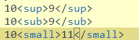

## 文字角标

### 文字角标
常用上标 ⁰ ¹ ² ³ ⁴ ⁵ ⁶ ⁷ ⁸ ⁹ ⁺ ⁻ ⁼ ⁽ ⁾ ⁿ º ˙

常用下标₀ ₁ ₂ ₃ ₄ ₅ ₆ ₇ ₈ ₉ ₊ ₋ ₌ ₍ ₎ ₐ ₑ ₒ ₓ ₔ ₕ ₖ ₗ ₘ ₙ ₚ ₛ ₜ

更多上标 ᵃ ᵇ ᶜ ᵈ ᵉ ᵍ ʰ ⁱ ʲ ᵏ ˡ ᵐ ⁿ ᵒ ᵖ ᵒ⃒ ʳ ˢ ᵗ ᵘ ᵛ ʷ ˣ ʸ ᙆ ᴬ ᴮ ᒼ ᴰ ᴱ ᴳ ᴴ ᴵ ᴶ ᴷ ᴸ ᴹ ᴺ ᴼ ᴾ ᴼ̴ ᴿ ˢ ᵀ ᵁ ᵂ ˣ ᵞ ᙆ ꝰ ˀ ˁ ˤ ꟸ ꭜ ʱ ꭝ ꭞ ʴ ʵ ʶ ꭟ ˠ ꟹ ᴭ ᴯ ᴲ ᴻ ᴽ ᵄ ᵅ ᵆ ᵊ ᵋ ᵌ ᵑ ᵓ ᵚ ᵝ ᵞ ᵟ ᵠ ᵡ ᵎ ᵔ ᵕ ᵙ ᵜ ᶛ ᶜ ᶝ ᶞ ᶟ ᶡ ᶣ ᶤ ᶥ ᶦ ᶧ ᶨ ᶩ ᶪ ᶫ ᶬ ᶭ ᶮ ᶯ ᶰ ᶱ ᶲ ᶳ ᶴ ᶵ ᶶ ᶷ ᶸ ᶹ ᶺ ᶼ ᶽ ᶾ ᶿ ꚜ ꚝ ჼ ᒃ ᕻ ᑦ ᒄ ᕪ ᑋ ᑊ ᔿ ᐢ ᣕ ᐤ ᣖ ᣴ ᣗ ᔆ ᙚ ᐡ ᘁ ᐜ ᕽ ᙆ ᙇ ᒼ ᣳ ᒢ ᒻ ᔿ ᐤ ᣖ ᣵ ᙚ ᐪ ᓑ ᘁ ᐜ ᕽ ᙆ ᙇ ⁰ ¹ ² ³ ⁴ ⁵ ⁶ ⁷ ⁸ ⁹ ⁺ ⁻ ⁼ ˂ ˃ ⁽ ⁾ ˙ * º

更多下标 ₐ ₔ ₑ ₕ ᵢ ⱼ ₖ ₗ ₘ ₙ ₒ ₚ ᵣ ₛ ₜ ᵤ ᵥ ₓ ᙮ ᵤ ᵩ ᵦ ₗ ˪ ៳ ៷ ₒ ᵨ ₛ ៴ ᵤ ᵪ ᵧ

中文上标 ㆒㆓㆔㆕㆖㆗㆘㆙㆚㆛㆜㆝㆞㆟


### html角标
```
<sup>上标 

<sub>下标

<small>小号字

<del> 删除线
```


结果


对应的 js 

stringObj.sup()  上标

stringObj.sub()  下标

stringObj.sub()  使用小字号显示

stringObj.strike() 使用删除线


彩蛋：
```
<!doctype html>
<html lang="en">
    <head>
        <meta charset="UTF-8" />
        <title>Document</title>
    </head>
    <body>
        <script type="text/javascript">
            var txt = "z-one"
 
            document.write("<p>1、Big--大号字体: " + txt.big() + "</p>")
            document.write("<p>2、Small--小号字体: " + txt.small() + "</p>")
 
            document.write("<p>3、Bold--粗体: " + txt.bold() + "</p>")
            document.write("<p>4、Italic--斜体: " + txt.italics() + "</p>")
 
            document.write("<p>5、Blink--字符串闪动: " + txt.blink() + " (does not work in IE)</p>")
            document.write("<p>6、Fixed--以打印机文本显示: " + txt.fixed() + "</p>")
            document.write("<p>7、Strike--删除线: " + txt.strike() + "</p>")
 
            document.write("<p>8、Fontcolor--字体颜色: " + txt.fontcolor("Red") + "</p>")
            document.write("<p>9、Fontsize--字体大小: " + txt.fontsize(16) + "</p>")
 
            document.write("<p>10、Lowercase--转换为小写: " + txt.toLowerCase() + "</p>")
            document.write("<p>11、Uppercase--转换为大写: " + txt.toUpperCase() + "</p>")
 
            document.write("<p>12、Subscript--下标: " + txt+txt.sub() + "</p>")
            document.write("<p>13、Superscript--上标: " +txt+ txt.sup() + "</p>")
 
            document.write("<p>14、Link--链接: " + txt.link("http://www.cnblogs.com/z-one") + "</p>")
        </script>
 
    </body>
 
</html>
```


